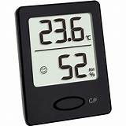
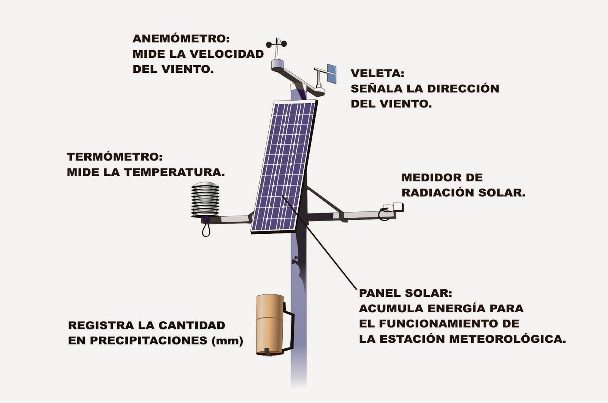
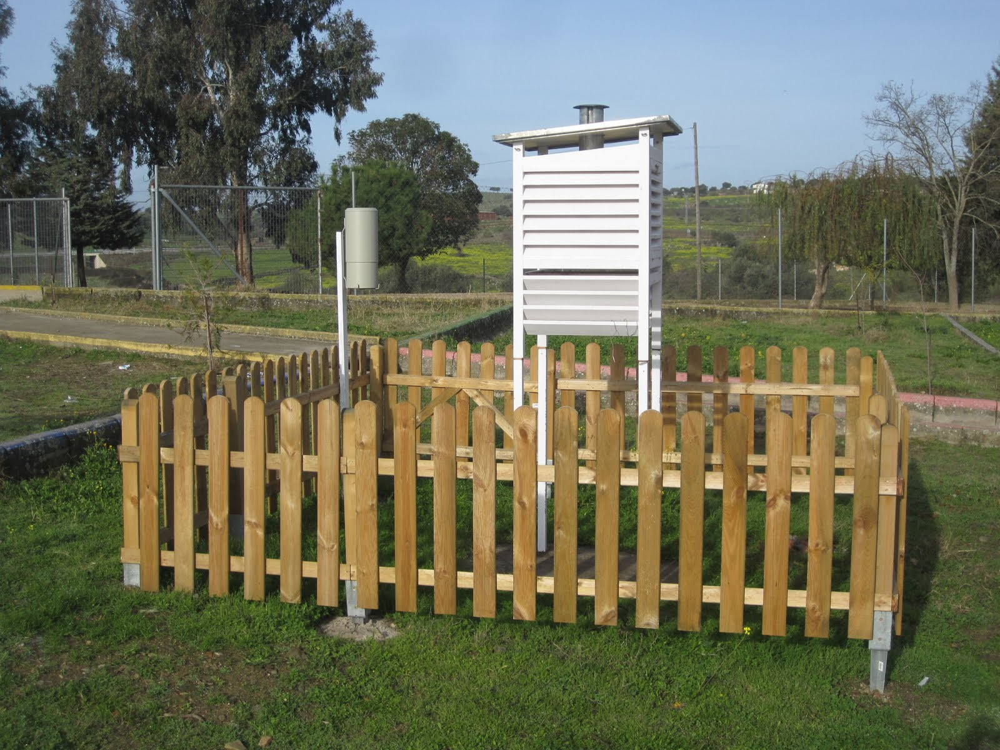

# FA_UD2_Características del clima y microclima

FUNDAMENTOS AGRONÓMICOS

UD 2

CARACTERÍSTICAS DEL CLIMA Y MICROCLIMA

## APARATOS DE MEDIDA DE VARIABLES CLIMÁTICAS

### Termómetro

Para medir la cantidad la **temperatura** se utiliza el termómetro. El termómetro más conocido es el de mercurio que basa su funcionamiento en la contracción y expansión que experimente el mercurio encerrado en un tubo de cristal calibrado, los termómetros de máxima y de mínima dejan marcados los puntos de temperatura más alta y más baja durante cualquier periodo. Aunque en la actualidad la mayoría de los termómetros son de uso digital, los más utilizados en Agricultura son los termómetros de infrarrojos que constan de un sensor que se pone en contacto con la superficie del cuerpo que queramos registrar la temperatura, bien sea el suelo o partes del vegetal. La temperatura del aire se suele medir en grados centígrados.

\Begin{figure}
\centering
\subfigure[Termómetro de max y min]{\includegraphics[width=0.3\linewidth]{./imgFun/UD2_image25.png}}
\subfigure[termómetro digital]{\includegraphics[width=0.3\linewidth]{./imgFun/UD2_image26.png}}
\subfigure[Termómetro infrarrojos]{\includegraphics[width=0.3\linewidth]{./imgFun/UD2_image27.png}}
\caption{Termómetros}
\End{figure}

### Barómetro

Para medir la **presión** utilizamos el barómetro. Hay dos tipos: los de mercurio y los aneroides.

\Begin{figure}
\centering
\subfigure[Barómetro de mercurio]{\includegraphics[width=0.3\linewidth]{./imgFun/UD2_image28.png}}
\subfigure[Barómetro aneroide]{\includegraphics[width=0.3\linewidth]{./imgFun/UD2_image29.png}}
\subfigure[Barómetro aneroide]{\includegraphics[width=0.3\linewidth]{./imgFun/UD2_image30.png}}
\caption{Barómetro}
\End{figure}

### Higrómetro

Para medir la **humedad** se utiliza un instrumento llamado higrómetro. Actualmente se utiliza el higrómetro digital. Este modelo realiza los cálculos a través de circuitos electrónico con los cuales se logra expresar en números las pequeñas alteraciones de tensión que son producidas por la variación de algunas propiedades físicas, mediciones que se pueden observar en la pantalla.

### Pluviómetro

Para medir las precipitaciones se usa el pluviómetro, hay muchísimos tipos de pluviómetros pero básicamente todos utilizan el mismo sistema, es un recipiente de forma cilíndrica graduado y que recoge el agua de lluvia caída.

{width=50%}

### Anemómetro y veleta

La velocidad del viento se mide con un anemómetro y la dirección del viento con la veleta.

El anemómetro es un aparato que juega un rol importante dentro del área de la meteorología, permitiendo medir la intensidad del viento. Los más comunes se componen de un sistema de pequeñas aspas y en sus extremos pequeñas cuencas las cuales se les permite oscilar, cuando el viento sopla esta gira y de esta forma arroja los resultados en el dispositivo. La veleta es un dispositivo giratorio que consta de un placa que gira libremente, un señalador que indica la dirección del viento y una cruz horizontal que indica los puntos cardinales.

\Begin{figure}
\centering
\subfigure[Veleta]{\includegraphics[width=0.4\linewidth]{./imgFun/UD2_image33.png}}
\subfigure[Anemómetro]{\includegraphics[width=0.4\linewidth]{./imgFun/UD2_image34.png}}
\caption{Anemómetro y veletas}
\End{figure}

Las distintas escala s de viento dependiendo de la velocidad son:

----------  --------------------------------------------- --------------
Calma		Temblor de hojas- ramas pequeñas se agitan.	  6 – 20 Km/h

Moderado	Las ramas grandes se mueven.			      21 – 40 Km/h

Fuerte		Los árboles se agitan.				          41 – 70 Km/h

Muy fuerte	Ramas arrancadas,- árboles arrancados.		  71 – 120 Km/h

Huracanado	Árboles arrancados, destrucción instalaciones > 120 Km/h
----------  --------------------------------------------- ---------------

### Estaciones meteorológicas

Una estación meteorológica es el lugar en el que se realizan observaciones del comportamiento de la atmósfera y del medio ambiente. La recopilación de datos emitidos por el instrumental meteorológico y su posterior análisis y estudio permitirán la realización de un diagnóstico de la situación atmosférica en un momento dado.

La ubicación de las estaciones es un aspecto muy importante para que la toma de datos sea correcta. La estación no puede estar en cualquier sitio. Ha de estar en terreno llano con césped y sus alrededores deben estar libres de obstáculos.

En una estación tipo tenemos tres elementos básicos: veleta y anemómetro para la medición del viento, el pluviómetro para medir las precipitaciones y la garita o caseta meteorológica. En su interior situaremos los termómetros de máxima y mínima, el psicrómetro/higrómetro y el termohidrógrafo.

Se recomienda que las garitas sean de madera, bien ventiladas, pintadas e blanco y esmaltadas para reflejar la radicación. El techo debe tener inclinación para escurrir el agua de la lluvia y la nieve y ha de ser doble, con circulación del aire entre ambos para evitar el calentamiento del aire cuando la radicación sea muy intensa. La puerta debe estar orientada al norte, para evitar que los rayos del sol toquen los instrumentos cuando realizamos las observaciones.

{width=50%}

{width=50%}
