# FA_UD1_Identificación de especies vegetales

FUNDAMENTOS AGRONÓMICOS

UD 1

IDENTIFICACIÓN DE LAS ESPECIES VEGETALES

## TAXONOMÍA VEGETAL

### Concepto

La Taxonomía es la parte de La biología que se ocupa de la clasificación u ordenación de los organismos, así como normas que regulan dicha clasificación.

Las plantas se ordenan en distintos grupos o categorías taxonómicas de acuerdo con las afinidades que presentan. Las divisiones taxonómicas son: reino, división, clase, orden, familia, género y especie.

|       | Pino Canario | Manzano |
| :---: | :---: | :---: |
| REINO:	|	Plantae | Plantae |
| DIVISIÓN:	| Pinophyta | Magnoliophyta|
| CLASE: | Pinopsida | Magnoliopsida |
| ORDEN: | Pinales	| Rosales |
| FAMILIA: | Pinaceae | Rosaceae |
| GÉNERO: | Pinus | Malus |
| ESPECIE:	|*Pinus canariensis C.Sm* | *Malus domestica Borkh*|

{width=50%}

La **especie** se nombra utilizando la nomenclatura binomial que es un nombre latín que se escribe en cursiva y consta de dos partes, el primero es el género y el segundo la especie. Los **nombres científicos** siempre se escriben en latín y en cursiva.

### Clasificación de las plantas

{width=50%}

**Monocotiledóneas y dicotiledóneas**

+ **CRIPTÓGAMAS**: son plantas que no tienen semillas, flores ni frutos y se reproducen por esporas. Por ejemplo algas, musgo y helecho.

\Begin{figure}
\centering
\subfigure[algas]{\includegraphics[width=0.3\linewidth]{./imgFun/UD1_image4.png}}
\subfigure[Musgo]{\includegraphics[width=0.3\linewidth]{./imgFun/UD1_image5.png}}
\subfigure[Helecho]{\includegraphics[width=0.3\linewidth]{./imgFun/UD1_image6.png}}
\caption{Plantas sin semillas}
\End{figure}

+ **FANERÓGAMAS**: son plantas que tienen flores. Es el grupo de plantas más evolucionado y el más importante para el ser humano. Se clasifican en:
  - **Gimnospermas**: plantas leñosas (árboles o arbustos) con hojas en forma de agujas o escamas, son perennes. No producen verdades flores, por lo tanto no producen frutos. La polinización se realiza generalmente por el aire. Ej. pino, abeto, ciprés, enebro.

\Begin{figure}
\centering
\subfigure[Cupressus sempervirens (ciprés común)]{\includegraphics[width=0.3\linewidth]{./imgFun/UD1_image7.png}}
\subfigure[Piña]{\includegraphics[width=0.3\linewidth]{./imgFun/UD1_image8.png}}
\subfigure[Pinus canariensis (pino canario)]{\includegraphics[width=0.3\linewidth]{./imgFun/UD1_image9.png}}
\caption{Ginospermas}
\End{figure}

  - **Angiospermas**: plantas que pueden ser herbáceas o leñosas con hojas anchas, semillas, flores y frutos. Estas se dividen en dos clases:
  \Begin{figure}
\centering
\subfigure[Melocotón]{\includegraphics[width=0.3\linewidth]{./imgFun/UD1_image10.png}}
\subfigure[Maiz]{\includegraphics[width=0.3\linewidth]{./imgFun/UD1_image11.png}}
\subfigure[Tomate]{\includegraphics[width=0.3\linewidth]{./imgFun/UD1_image12.png}}
\caption{Angiospermas}
\End{figure}
    - **Monocotiledóneas**: tiene un solo cotiledón: maíz, cebolla, arroz, palmeras…
    - **Dicotiledóneas**: la semilla tiene dos cotiledones (primeras hojas del embrión): melocotón, toamate, manzana, naranja…

{width=50%}

\Begin{figure}
\centering
\subfigure[Fig1]{\includegraphics[width=0.4\linewidth]{./imgFun/UD1_image14.jpg}}
\subfigure[Fig2]{\includegraphics[width=0.4\linewidth]{./imgFun/UD1_image15.jpg}}
\caption{Dicotiledóneas}
\End{figure}

{width=50%}

## LA CÉLULA VEGETAL

### Definición

Es la porción más pequeña de los seres vivos dotada de vida propia: nace, crece y se reproduce.

- Los seres vivos de una sola célula: **unicelulares**: bacterias

- Los seres vivos que tienen más de una célula se llaman **pluricelulares**: cada célula que lo integra tiene vida propia, pero la actividad de cada una de ellas se coordina con las demás, y así se forma un organismo de una categoría superior a la de aquellos otros constituidos por una sola célula. P.ej. Elefante, pino..

La mayoría de las células tienen un tamaño pequeñísimo y para observarlas se hace al microscopio.

Existen dos tipos de organización celular:

- **Células Procariotas**: Carecen de núcleo claramente diferenciado y orgánulos internos. El material genético está formado por un ADN simple. A este grupo de células pertenecen las bacterias.

- **Células Eucariotas**: Son mucho mayores y mucho más complejas que las procariotas. Tienen núcleo y el material genético se encuentra en forma de cromosomas. También tienen varios orgánulos y varios compartimientos.

Las células eucariotas pueden ser animales o vegetales. La célula vegetal, aunque es similar a la célula animal, se caracteriza por presentar algunas estructuras ausentes en las células animales tales como la pared celular, las vacuolas y los cloroplastos.

Vídeo sobre las [células procariotas y Eucariotas](https://www.youtube.com/watch?v=FJx0auAdQsw)

{width=50%}

La célula vegetal, aunque es similar a la célula animal, se caracteriza por presentar algunas estructuras ausentes en las células animales tales como la pared celular, las vacuolas y los cloroplastos.

- **Pared celular**: Es una capa o estructura rígida cuya función es proteger a la membrana plasmática y dar rigidez y forma a la célula.

- **Cloroplastos**: Son orgánulos característicos de la célula vegetal pues en ellos tiene lugar el proceso de la fotosíntesis.

- **Vacuola**: Son orgánulos que pueden ocupar hasta el 90% de toda la célula, tienen función de almacenamiento, puede almacenar agua, sales minerales y otros nutrientes.

## LOS TEJIDOS VEGETALES

Las plantas al igual que los demás seres vivos como los animales también poseen células, el conjunto de células con una misma función forman tejidos, el conjunto de tejidos forman un órgano. En el caso de una planta los órganos son sus hojas, su tallo, su raíz, sus flores…

Vídeo a [visualizar](https://www.youtube.com/watch?v=t875WBrVarA)

{width=50%}

### Tejidos meristemáticos

Son los tejidos de formación o crecimiento. Son los tejidos que se encuentran en una planta joven que está en pleno crecimiento y son los responsables del crecimiento de la planta. Originan los demás tejidos. Los tejidos meristemáticos persisten en la planta durante toda su vida, por lo que la planta puede crecer toda su vida.

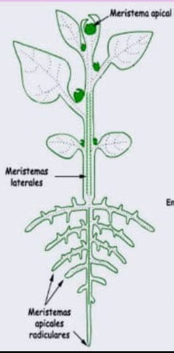{width=50}

- **Embrionario**: presentes en las semillas y cuándo éstas germinan.

- **Meristemo apical**: responsables del crecimiento en longitud de la planta. Se localizan en el extremo de la raíz y la planta.

- **Meristemo lateral**: responsables del crecimiento en grosor, se va a encontrar en el tallo.

*Por ejemplo:* en una patata, los "ojos" son puntos de crecimiento que contienen tejido meristemático. De estos brotes pueden surgir nuevas plantas.

### Tejidos protectores

Son aquellos tejidos encargados de proteger a la planta. Existe dos tipos:

- **Epidermis**: es la capa mas externa del vegetal y de las hojas. Se encuentra en plantas herbáceas.

- **Peridermis o súber**: reemplaza a la epidermis en los tallos y raíces de las plantas leñosas (corcho).

*Por ejemplo:* la cáscara de una manzana o de un pepino es un ejemplo de tejido dérmico.

### Tejidos conductores

El sistema vascular lo forman dos tipos de tejidos conductores:

- **Xilema**: Es el encargado de hacer circular la savia bruta, el agua y las sales minerales absorbidas desde la raíces de las hojas. 

- **Floema**: Son los vasos encargados de distribuir la savia elaborada producida en las hojas, es decir, las sustancias alimenticias resultado de la fotosíntesis.

*Por ejemplo*: En el apio, los "hilos" fibrosos que se pueden separar son haces vasculares de xilema 	y floema

### Tejidos fundamentales

Se compone de tres tejidos:

- **Parénquima**: Este es el tejido más común en las plantas, y lo podemos imaginar como el "relleno suave" de la planta. Sus células tienen muchas funciones, como ayudar a la planta a hacer la fotosíntesis (fabricar alimento) y a almacenar agua y nutrientes. El parénquima está en casi todas partes de la planta, como en las hojas, tallos y raíces. Es como el "todo terreno" de los tejidos porque puede hacer muchas cosas dependiendo de dónde se encuentre: fotosíntesis en la hoja, almacenamiento de reservas en raíz y tallo (p.ej. La patata que es un tallo y almacena almidón), regeneración de tejidos (cicatrización de heridas)…

*Por ejemplo:* La pulpa de la pera, donde se almacenan agua y nutrientes y la patata que almacena 	almidón.

- **Colénquima**: Este tejido es como el "soporte flexible" de la planta. Está compuesto de células que le dan resistencia a la planta, pero al mismo tiempo permiten que sea flexible. Imagina que es como el cartílago en nuestros oídos: es firme, pero se puede doblar sin romperse. El colénquima está principalmente en los tallos jóvenes y en las hojas, ayudando a las partes más jóvenes de la planta a mantenerse firmes mientras crecen.

*Por ejemplo*: el borde de las hojas de la lechuga, que proporcionan soporte pero es flexible y en lo****s hilos que puedes ver si doblas suavemente el tallo de un apio.**

- **Esclerénquima**: Este es el tejido "superfuerte" de la planta. Está hecho de células con paredes muy gruesas, que proporcionan mucha resistencia y dureza. Cuando las células del esclerénquima se desarrollan completamente, se vuelven rígidas y a menudo mueren, pero siguen cumpliendo su función como una especie de "armadura". Se encuentran en partes de la planta que necesitan mucha resistencia. Es como si fuera el "hueso" de la planta.

*Por ejemplo* la cáscara de nuez, el cáscara de un coco, el hueso del melocotón.

## MORFOLOGÍA Y ESTRUCTURA DE LAS PLANTAS.

Las plantas, de forma general, están compuestas por el aparato vegetativo: raíz, tallo y hojas y por el aparato reproductor, constituido por la flor que da origen al fruto y que a su vez porta en su interior la semilla.

{width=50%}

### LA RAÍZ

La raíz es un órgano que cumple las siguientes funciones:

- Fija la planta al suelo.

- Absorbe el agua y elementos minerales contenidos en el suelo.

Por lo general, la raíz se ramifica dentro del suelo, diferenciándose en ella una o varias raíces principales o primarias, que van unidas al tallo, y varias raíces de menor porte, llamadas raíces secundarias, que salen de la raíz o raíces principales. El conjunto de todas las raíces de una planta forman un sistema radicular.

#### TIPOS DE RAÍCES

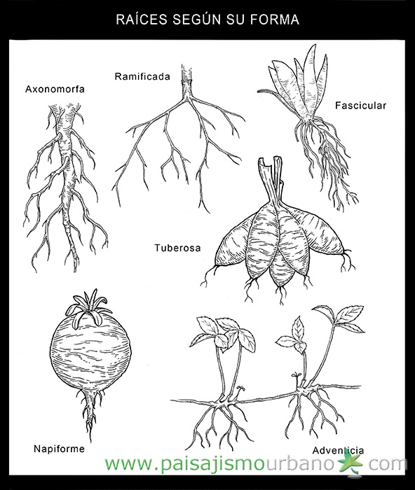{width=50%}

Según su forma:

- **Pivotantes o axonomorfas**:Judía, naranjo, limón

- **Fasciculada**: Cebolla, ajo, trigo...

- **Ramificada**: perejil

- **Napiforme**: Zanahoria, rábano, nabo, chirivía...

- **Tuberosa**: remolacha, dalia

- **Adventicias o aéreas**: fresa, hiedra…

### EL TALLO

Es un órgano generalmente aéreo, que constituye el eje de la planta, sostiene las hojas, conduce la savia y acumula, si es necesario, reservas alimenticias. Suele ser de forma cilíndrica y crece en sentido opuesto a la raíz. En el tallo hay que distinguir las siguientes partes:

- **Nudos**: son las partes salientes donde las hojas se unen al tallo.

- **Entrenudos**: son las partes del tallo comprendidas entre dos nudos.

- **Yemas**: abultamientos que al desarrollarse originan hojas, flores o ramificaciones del tallo.

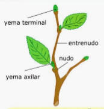{width=25%}

#### CLASIFICACIÓN DE LOS TALLOS

Los tallos se pueden clasificar atendiendo a diferentes criterios. Si los clasificamos tomando como referencia su consistencia o dureza tenemos:

- **LEÑOSOS**

Son rígidos y duros. Según su altura los clasificamos en:

  - **Árboles**: plantas de tallo leñoso con una altura superior a cinco metros. En los árboles el tallo se llama tronco. Ej. pino, chopo.

  - **Arbustos**: plantas de tallo leñoso que miden entre uno y cinco metros de altura. Ej. lentisco, boj.

  - **Matas**: plantas de tallo leñoso con una altura inferior al metro. Ej. tomillo, romero.

\Begin{figure}
\centering
\subfigure[Nogal]{\includegraphics[width=0.3\linewidth]{./imgFun/UD1_image24.png}}
\subfigure[Boj]{\includegraphics[width=0.3\linewidth]{./imgFun/UD1_image25.png}}
\subfigure[Tomillo]{\includegraphics[width=0.3\linewidth]{./imgFun/UD1_image26.png}}
\caption{Leñosos}
\End{figure}

- **SEMILEÑOSOS**

Tienen una consistencia media entre los herbáceos y leñosos. Medio consistentes y huecos, se llaman cañas. Ej. caña común, vid...

\Begin{figure}
\centering
\subfigure[Caña común]{\includegraphics[width=0.4\linewidth]{./imgFun/UD1_image27.png}}
\subfigure[Vid]{\includegraphics[width=0.4\linewidth]{./imgFun/UD1_image28.png}}
\caption{Semileñosos}
\End{figure}

- **HERBÁCEOS**

Son tiernos y flexibles. No tienen una estructura endurecida, es blanda, no tienen madera. Son las plantas herbáceas. Pueden ser:

  - RASTRERO: calabaza, melón...

{width=50%}

  - SUBTERRÁNEOS: aunque tienen la apariencia externa de raíces, su estructura es la de un tallo.
  
    - **Rizomas**: son unos tallos de crecimiento horizontal por debajo de la superficie del terreno. Como el jengibre, lirio.
    - **Tubérculos**: es una porción de tallo subterráneo lleno de sustancias de reserva, como la patata.
    - **Bulbos**: cebolla y el ajo serían un ejemplo.

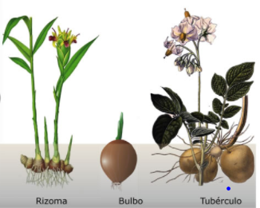{width=50%}

### LA HOJA

Las hojas son unos órganos verdes que salen del tallo y que ejecutan dos funciones muy importantes en la vida de la planta: fotosíntesis y transpiración.

Las partes en las que se divide una hoja son:

- **Limbo o lámina**: es la parte ancha de la hoja. La cara superior se llama haz y la inferior se llama envés.

- **Peciolo o rabo**: es la parte cilíndrica de la hoja que hace de unión con la rama o brote. Las hojas que no tienen peciolo se llaman sentadas.

- **Nervios**: El limbo de la hoja es surcado por los nervios, que son una prolongación de los vasos que recorren las raíces, el tallo y las ramas y se introducen por el peciolo de las hojas y se ramifican en el limbo.

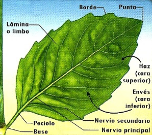{width=75%}

Se pueden clasificar las hojas atendiendo al número de limbos por peciolo. Si sólo hay un limbo por peciolo hablamos de hojas simples, si tiene varios limbos por peciolo se denominan hojas compuestas.

Las hojas pueden ser caducas, perennes o marcescentes (se secan en el árbol pero permanecen hasta la formación de las siguientes)

Las hojas se pueden adoptar numerosas formas:

\Begin{figure}
\centering
\subfigure[Fig1]{\includegraphics[width=0.6\linewidth]{./imgFun/UD1_image32.png}}
\subfigure[fig2]{\includegraphics[width=0.3\linewidth]{./imgFun/UD1_image33.png}}
\caption{Hojas}
\End{figure}

### LAS FLORES

La flor es el aparato reproductor de las fanerógamas.

- **Cáliz**: envoltura exterior, formado por unas hojas recias y verdes llamadas sépalos.

- **Corola**: formada por unas hojas finas y coloreadas llamadas pétalos.

- **Estambres o androceo**: es el órgano masculino de la flor.

- **Gineceo**: es el órgano femenino de la flor. 

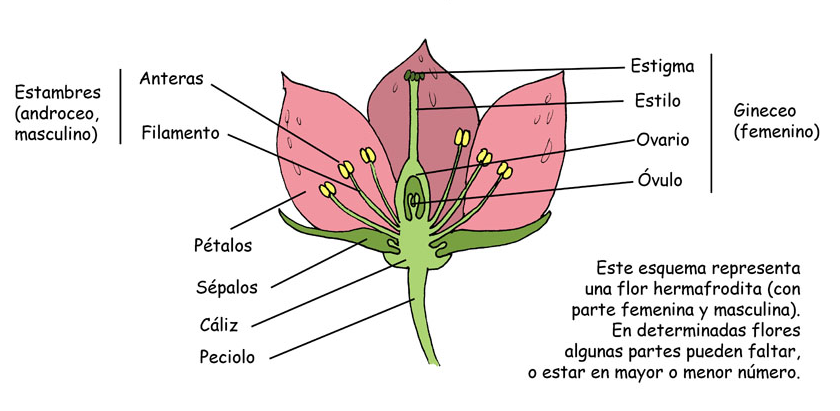{width=50%}

La función del cáliz y corola es la protección del androceo y gineceo. Por su colorido, aroma y presencia de néctar, favorece la atracción de insectos polinizadores.

El **gineceo**, es el órgano femenino de la flor, y se encuentra formado por los el pistilo, el estigma y el ovario, donde están los óvulos, que al ser fecundados por el polen, se transformarán en semillas y las paredes del ovario darán origen al fruto.

El **androceo**, u órgano masculino de la flor, está formado por los estambres donde se encuentra el filamento que soporta la antera, donde se produce el polen.

Llamamos flores hermafroditas cuando en ella encontramos gineceo y androceo. Si les falta alguno de los dos serán unisexuales. Si solo tienen gineceo, serán flores femeninas. Si solo tienen androceo, serán flores masculinas. Un ejemplo de flores unisexules, el calabacín:

{width=50%}

{width=50%}

#### TIPOS DE FLORES

Podemos ver que las formas de las flores son muy variadas en función de su corola, inflorescencia…

- **SEGÚN SU COROLA**:

  - **Gamopétalas**: los pétalos están soldados total o parcialmente.

\Begin{figure}
\centering
\subfigure[Fig1]{\includegraphics[width=0.2\linewidth]{./imgFun/UD1_image37.png}}
\subfigure[fig2]{\includegraphics[width=0.2\linewidth]{./imgFun/UD1_image38.png}}
\subfigure[fig3]{\includegraphics[width=0.2\linewidth]{./imgFun/UD1_image39.png}}
\subfigure[fig4]{\includegraphics[width=0.2\linewidth]{./imgFun/UD1_image40.png}}
\caption{Gamopétala}
\End{figure}

  - **Dialipétalas**: los pétalos no están unidos. Serían:

\Begin{figure}
\centering
\subfigure[Fig1]{\includegraphics[width=0.2\linewidth]{./imgFun/UD1_image41.png}}
\subfigure[fig2]{\includegraphics[width=0.2\linewidth]{./imgFun/UD1_image42.png}}
\subfigure[fig3]{\includegraphics[width=0.2\linewidth]{./imgFun/UD1_image43.png}}
\subfigure[fig4]{\includegraphics[width=0.2\linewidth]{./imgFun/UD1_image44.png}}
\caption{Dialipétalas}
\End{figure}

- **SEGÚN LA FORMA DE LA INFLORESCENCIAS**

Por lo general, las flores no salen aisladas, sino en grupos. El conjunto de flores que salen del mismo brote recibe el nombre de inflorescencia. Algunas de ellas son:

\Begin{figure}
\centering
\subfigure[Racimo]{\includegraphics[width=0.2\linewidth]{./imgFun/UD1_image45.png}}
\subfigure[Espiga]{\includegraphics[width=0.2\linewidth]{./imgFun/UD1_image46.png}}
\subfigure[Corimbo]{\includegraphics[width=0.2\linewidth]{./imgFun/UD1_image47.png}}
\subfigure[Umbela]{\includegraphics[width=0.2\linewidth]{./imgFun/UD1_image48.png}}
\caption{INFLORESCENCIAS}
\End{figure}

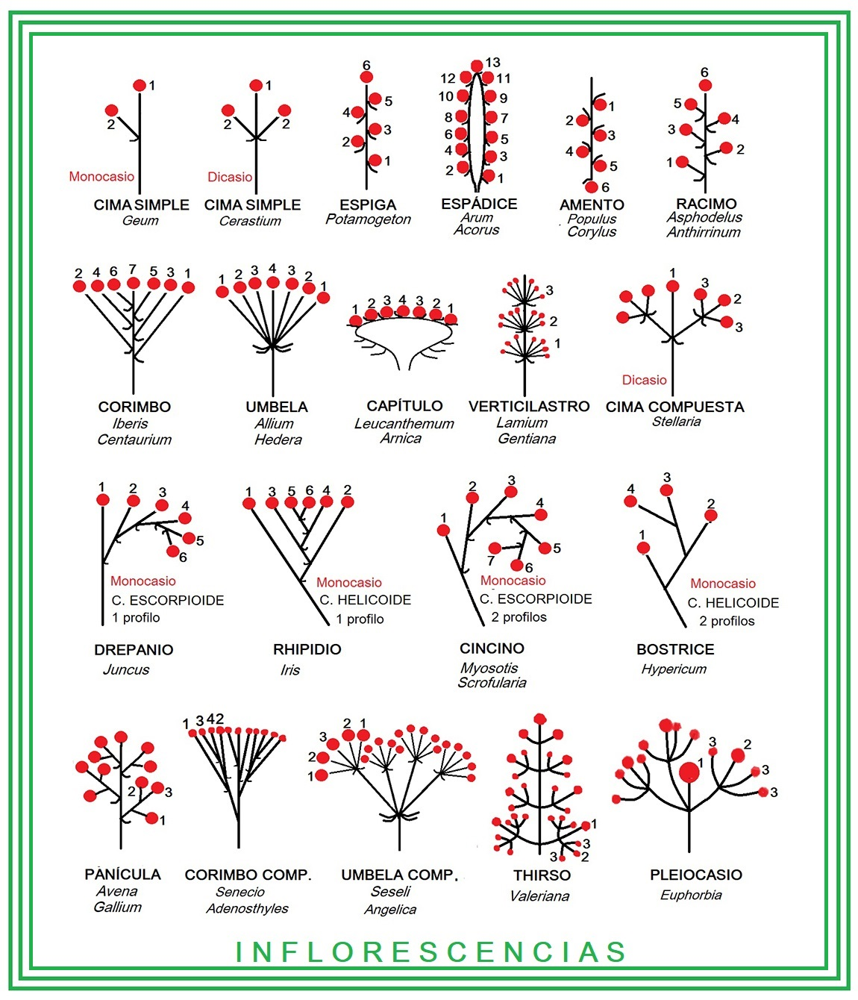{width=50%}

### EL FRUTO

El fruto es el ovario desarrollado y maduro, una vez fecundado el óvulo. La semilla es el óvulo fecundado y maduro. Así como el ovario se encarga de proteger el óvulo, el fruto protege las semillas hasta que esté completamente madura. En el proceso de maduración, el estambre y pétalos se marchitan y caen.

{width=50%}

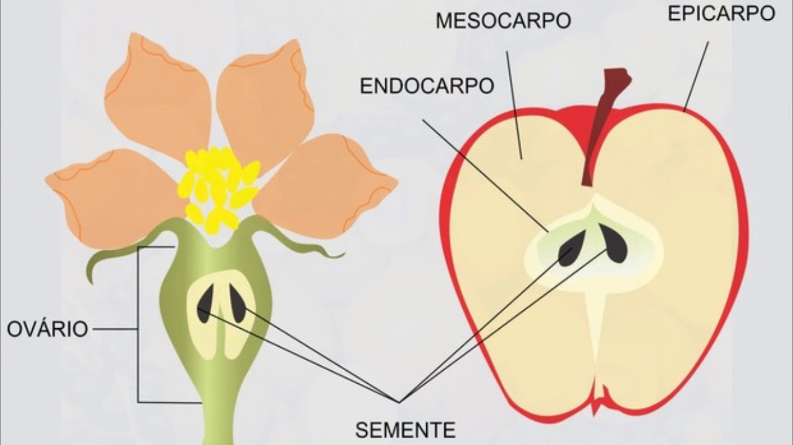{width=50%}

El fruto está formado por tres capas:

- **Exocarpo**: Es la capa exterior y se suele llamar comúnmente piel o cáscara. Puede ser liso (cereza), recubierto de ceras (uva, ciruelas), con pelos y suaves (melocotón), granuloso (naranja).

- **Mesocarpo**: es la capa intermedia del fruto. Unas veces es delgado y seco (naranja) y otras veces grueso y carnoso (melocotón, manzana).

- **Endocarpo**: es la capa interior del fruto, dónde está la semilla. Puede ser membranoso (manzana), leñoso (hueso melocotón), jugoso (naranja).

{width=50%}

{width=50%}

\Begin{figure}
\centering
\subfigure[Figura 1]{\includegraphics[width=0.4\linewidth]{./imgFun/UD1_image54.png}}
\subfigure[Figura 2]{\includegraphics[width=0.4\linewidth]{./imgFun/UD1_image55.png}}
\caption{Fruto}
\End{figure}

#### TIPOS DE FRUTOS

Las angiospermas si que tienen frutos verdaderos que, atendiendo a su consistencia, tenemos **frutos secos** (jugosos al principio pero que se secan al madurar), por ejemplo la almendra, y **frutos carnosos** (jugosos en el momento de la maduración).

Nos vamos a centrar sobretodo en los carnoso:

- **TIPOS DE FRUTOS SECOS**

  - **Aquenio**: pericarpo delgado y no está soldado a la semilla: girasol, avellana

\Begin{figure}
\centering
\subfigure[Girasol]{\includegraphics[width=0.4\linewidth]{./imgFun/UD1_image56.png}}
\subfigure[Avellana]{\includegraphics[width=0.4\linewidth]{./imgFun/UD1_image57.png}}
\caption{Aquenio}
\End{figure}

  - **Nuez o núcula**: es como el aquenio pero el pericarpo es duro: nuez

\Begin{figure}
\centering
\subfigure[Nuez]{\includegraphics[width=0.4\linewidth]{./imgFun/UD1_image58.png}}
\subfigure[Nuez]{\includegraphics[width=0.4\linewidth]{./imgFun/UD1_image59.png}}
\caption{Nuez o núcula}
\End{figure}

  - **Cariópside**: pericarpo soldado a la semilla: trigo, arroz

{width=50%}

  - **Legumbre**: se abre en dos valvas: garbanzos, habas, cacahuete.

\Begin{figure}
\centering
\subfigure[Cacahuete]{\includegraphics[width=0.3\linewidth]{./imgFun/UD1_image61.png}}
\subfigure[Habas]{\includegraphics[width=0.3\linewidth]{./imgFun/UD1_image62.png}}
\subfigure[Garbanzo]{\includegraphics[width=0.3\linewidth]{./imgFun/UD1_image63.png}}
\caption{Cariópside}
\End{figure}

  - **Cápsula**: amapola, verdolaga….

\Begin{figure}
\centering
\subfigure[Amapola]{\includegraphics[width=0.2\linewidth]{./imgFun/UD1_image64.png}}
\subfigure[Amapola]{\includegraphics[width=0.2\linewidth]{./imgFun/UD1_image65.png}}
\subfigure[Amapola]{\includegraphics[width=0.2\linewidth]{./imgFun/UD1_image66.png}}
\subfigure[Verdolaga]{\includegraphics[width=0.2\linewidth]{./imgFun/UD1_image67.png}}
\caption{Cápsula}
\End{figure}

- **TIPOS DE FRUTOS CARNOSOS**

  - **Drupa**: Es un fruto carnoso con hueso en su interior. Melocotón, nectarina, olivo, ciruela, cereza.

  - **Baya**: Fruto carnoso sin hueso pero con muchas semillas. Tomate, uva, berenjena...

  - **Pomo**: Fruto carnoso que tiene un corazón donde se alojan varias semillas. Manzana, pera.

  - **Hesperidio**: Es una modificación de la baya, pero a diferencia de estos, no es comestible en su totalidad ya que tiene el pericarpo externo grueso y coriáceo y el mesocarpo corchoso. Limón, naranja.

  - **Pepónides**: frutos que se identifican por tener una corteza bastante dura y gran cantidad de semillas en su interior. Por ejemplo sandía, calabaza, pepino.

\Begin{figure}
\centering
\subfigure[Cereza]{\includegraphics[width=0.17\linewidth]{./imgFun/UD1_image68.png}}
\subfigure[Berengena]{\includegraphics[width=0.17\linewidth]{./imgFun/UD1_image69.png}}
\subfigure[Pera]{\includegraphics[width=0.17\linewidth]{./imgFun/UD1_image70.png}}
\subfigure[Limóm]{\includegraphics[width=0.17\linewidth]{./imgFun/UD1_image71.png}}
\subfigure[Limóm]{\includegraphics[width=0.17\linewidth]{./imgFun/UD1_image72.png}}
\caption{Tipo de fruto carnoso}
\End{figure}

### LA SEMILLA

El óvulo fecundado y maduro es la semilla. Desde que el embrión empieza a germinar, y hasta que la plántula se independiza, se conoce este proceso como germinación.

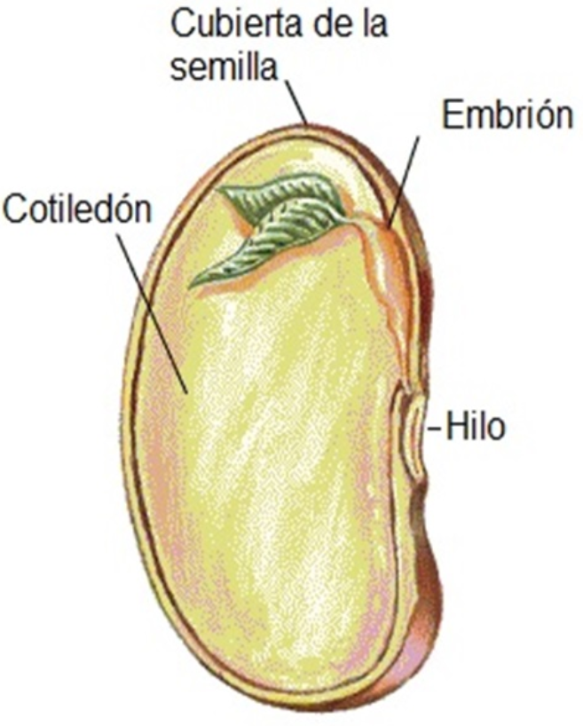{width=50%}

En la semilla encontramos varias partes:

- **Tegumento**: cubierta o envoltura de la semilla, es la parte exterior.**
- **Cotiledones**: es el tejido de reserva alimenticia.
- **Embrión**: es una planta en miniatura encerrada dentro de la semilla y que al desarrollarse se convierte en una nueva planta. **

## LOS PROCESOS FISIOLÓGICOS

### LA FOTOSÍNTESIS

La fotosíntesis es el proceso mediante el cual los vegetales provistos de clorofila sintetizan o forman su propia materia orgánica a partir del agua y del dióxido de carbono (CO2). La energía necesaria para este proceso es tomada de la luz del sol, por tanto la fotosíntesis no se realiza en la oscuridad.

El agua y las sales minerales absorbidos por la raíz constituyen la savia bruta. Esta es transportada a través del xilema hasta las hojas y otras partes de la planta, donde tiene lugar la fotosíntesis. Una vez realizada la fotosíntesis, se distribuye la savia elaborada a través del floema a todas las partes de la planta.

El proceso de la fotosíntesis se resume:

**Dióxido de carbono** + **Agua** + **Energía de la luz solar** $\to$ **Glucosa(materia orgánica)** + **Oxígeno**

Durante la fotosíntesis las plantas:

- Consumen dióxido de carbono, gas perjudicial.
- Producen oxígeno, gas beneficioso y fundamental para la respiración de todos los seres vivos.
- Fabrican hidratos de carbono, energía que se utiliza para su alimentación y su desarrollo.

### RESPIRACIÓN

La respiración es el proceso contrario a la fotosíntesis, tiene lugar de día y de noche, aunque de día queda enmascara por la fotosíntesis. Esto se debe a que necesitan tener energía las 24h del día.

**Glucosa** + **Oxígeno** $\to$ **Dióxido de carbono** + **Agua** + **Energía**

Durante la respiración se consume oxígeno y se despresde dióxido de carbono, pero su principal objetivo es obtener energía con la que realizar muchas otras funciones en la planta, por ejemplo: absorber nutrientes y agua por las raíces, crecimiento, etc.

La respiración celular se realiza en la mitocondria.

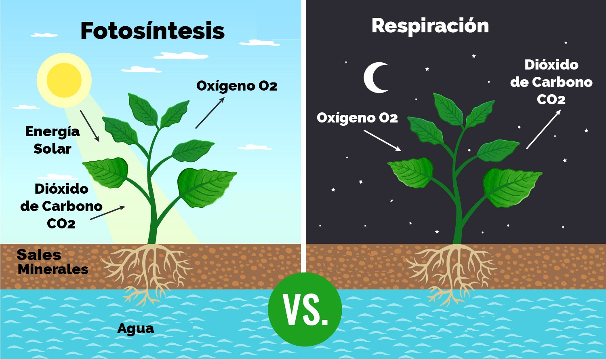{width=50%}

### TRANSPIRACIÓN

La savia bruta es una disolución de sustancias minerales en agua. Para que esta disolución pueda ser absorbida por las raíces tiene que tener muy baja concentración; pero al hacer la fotosíntesis es preciso eliminar la mayor parte del agua contenida en la savia bruta. Este proceso de eliminación del agua sobrante es la transpiración y se produce en forma de vapor de agua a través de los estomas de las hojas.

**Transpiración:**

Proceso por el cual la planta desprende agua en forma de vapor a través de los estomas de las hojas, aunque puede realizarse por toda la planta

\Begin{figure}
\centering
\subfigure[Imagen 1]{\includegraphics[width=0.4\linewidth]{./imgFun/UD1_image76.png}}
\subfigure[Imagen 2]{\includegraphics[width=0.4\linewidth]{./imgFun/UD1_image77.png}}
\caption{Transpiración}
\End{figure}

El agua absorbida por las plantas tiene el siguiente destino:

- Una pequeña porción queda en la planta formando parte de ella.
- Una gran parte tiene únicamente la misión de transportar las sales minerales hasta las hojas. Una vez cumplida esta misión, es eliminada al exterior en forma de vapor de agua.

Para el normal desarrollo de la planta debe existir un equilibrio entre el agua absorbida y el agua transpirada. Si este desequilibrio dura poco tiempo se presentan pequeños inconvenientes; pero si se prolonga más tiempo puede provocar lesiones o causar la muerte de la planta por marchitez.

La cantidad de agua transpirada depende de que los estomas estén más o menos abiertos. La transpiración en las hojas permite:

- Por un lado, que la savia bruta cargada de sales minerales suba desde las raíces hasta las partes altas de la planta.
- Por otro lado, las hojas están constantemente expuestas al sol para captar su luz y, por tanto, captan también su energía calorífica. Como resultado las hojas aumentan su temperatura. Mediante la transpiración las plantas pueden refrigerar sus hojas haciendo que disminuya el exceso de temperatura del mismo modo que los animales sudan para bajar la temperatura de su piel cuando hace mucho calor.

Cuanto más seco sea el ambiente y más calor haga, mayor será la transpiración en la planta, hasta un límite donde empiezan a funcionar los mecanismos de defensa para las condiciones adversas, que consiste en cerrar los estomas (para evitar deshidrataciones) y detención de los procesos vegetativos.

# FA_UD2_Características del clima y microclima

FUNDAMENTOS AGRONÓMICOS

UD 2

CARACTERÍSTICAS DEL CLIMA Y MICROCLIMA

## CLIMA Y MICROCLIMA

Llamamos **clima** al conjunto de condiciones atmosféricas (temperaturas, precipitaciones, humedad, viento…) que predominan en una zona de la Tierra*.*

Llamamos **microclima** al conjunto de condiciones climáticas que predominan en un determinado lugar por sus características distintas a las de la zona en que se encuentra.

La diferencia entre tiempo y clima es que el **tiempo** es el estado de la atmósfera en un momento y en un lugar determinado. Es algo instantáneo y cambiante. El **clima** es una sucesión periódica de tipos de tiempo. Es el conjunto de condiciones atmosféricas que predominan en una zona de la tierra. Es la suma de los tipos de tiempo que hay en un lugar.

Hay una serie de factores geográficos que definen el clima de cada región, los más importantes son:

- **L****atitud****: la distancia a la que nos encontramos del Ecuador ****terrestre. ****Cuanto más lejos estemos del ecuador más frío hará. Determina las 3 zonas climáticas: ****Zonas frías, templadas y cálidas.**

- **Altitud****: la altura ****de un lugar respecto al nivel del mar. ****Influye en la temperatura, siendo más frías en las zonas altas y en las precipitaciones, siendo más abundan en las zonas altas. ****Conforme subimos en altura la temperatura desciende del orden de 0´6 ****a 1º**** por cada 100 m y las posibilidades de lluvia aumentan porque el aire frío tiene menos capacidad de retener el vapor de agua.**

- **Relieve****: no es lo mismo las zonas de montaña que las zonas de pradera o bosques.**

- **Distancia al mar:**** y la mayor o menor influencia de sus brisas ya que el mar suaviza las temperaturas. ****En invierno el mar da calor a la tierra y en verano refresca la tierra. **

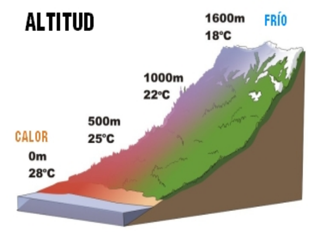

### Tipos de climatología

Básicamente se distinguen tres tipos de clima: cálido, templado y polar. Es decir, en términos más coloquiales: caluroso, equilibrado y frío.

En la siguiente clasificación vamos a ver a grandes rasgos los tipos de climas que hay y las características de cada uno. Además, de cada gran tipo de clima hay algunos subtipos mucho más detallados atendiendo a zonas más pequeñas.

- **CLIMAS CÁLIDOS****: **Estos climas se caracterizan por tener altas temperaturas. La media de la temperaturas anuales rondan los 20 grados y apenas ha diferencias muy grandes entre estaciones. Son lugares donde abundan las praderas y selvas con alta humedad ambiental y, en muchos casos, precipitaciones abundantes. Nos encontramos son los subtipos: Ecuatorial, tropical, subtropical árido, desértico y semidesértico.

- **CLIMAS ****TEMPLADOS****: **Se caracterizan por tener temperaturas medias que rondan los 15 grados. En estos climas podemos ver las estaciones del año bien diferenciadas. Nos encontramos con lugares repartidos entre las latitudes medias . Tenemos los subtipos siguientes: clima mediterráneo, chino, oceánico y continental.

- **CLIMAS ****FRÍOS****: **En estos climas las temperaturas no suelen superar los 10 grados centígrados y hay abundantes precipitaciones en forma de nieve y hielo. Tenemos el clima polar y el clima de alta montaña.

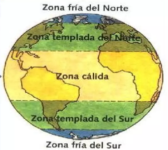

### Los climas de España

España cuenta grandes rasgos con dos tipos de climas: el templado y el subtropical canario,  pero su situación geográfica peculiar entre un océano y un mar y la complejidad orográfica de nuestro relieve complican nuestra condición climática, provocando que cada uno de ellos tenga a su vez variantes climáticas.

- ***Clima oceánico******: Propio de la fachada norte de España, con gran influencia del mar y grandes precipitaciones durante todo el año.***

- ***Clima continental******: Presenta una temperatura media mayor de 30ºC durante el mes mas cálido y menos de 0ºC durante el mes mas frío.***

- ***Clima mediterráneo:****** son zonas litorales del mediterráneo. Inviernos suaves y veranos cálidos. Pocos días de lluvia al año pero de gran intensidad, concentradas en otoño e invierno.***

- ***Subtropical******: el clima subtropical canario es muy diferente al resto de España debido a su latitud y a las corrientes de agua fría que atemperan la influencia de las altas temperaturas africanas.***

- ***Clima de montaña******: propias de las altas montañas. Temperaturas e inviernos largos y muy fríos. Precipitación en forma de nieve. Ver******a******nos cortos y calurosos.***

### Características del clima mediterráneo

El clima mediterráneo es un subtipo de clima .Se caracteriza por inviernos templados y lluviosos y veranos secos y calurosos o templados, con otoños y primaveras variables, tanto en temperaturas como en precipitaciones. El nombre lo recibe del mar Mediterráneo, área donde es típico este clima y adquiere mayor extensión geográfica, pero también está presente en otras zonas del planeta, aunque con variaciones en cuanto a la distribución de las temperaturas.

Las lluvias no suelen ser muy abundantes, aunque hay zonas donde se sobrepasan los 1000 mm. Pero la característica principal es que estas no se producen en verano.

Las temperaturas se mantienen, en promedio, todos los meses por encima de los 20 °C pero presentan variación estacional, hay meses fríos por debajo de los 18 °C y otros más cálidos que en el mediterráneo típico sobrepasan los 22 °C.

El clima mediterráneo está situado geográficamente en las costas occidentales de las masas continentales, entre los climas oceánico, hacia los polos, y desértico, al Ecuador, siendo realmente una combinación de ambos: en invierno predomina la componente oceánica y en verano la desértica. Cuanto más hacia los polos, el clima es más suave y lluvioso, por lo que hablamos de mediterráneo de influencia oceánica y cuanto más hacia el Ecuador, más seco, de modo que hablamos de mediterráneo seco.

## ELEMENTOS CLIMÁTICOS

### La temperatura

El sol lo consideramos como el motor del tiempo, ya que es la fuente de energía que pone en marcha los procesos meteorológicos. Éstos empiezan con el calentamiento del aire que provoca su movimiento y su variación en su retención del agua. La variación de la temperatura del aire depende de la latitud, de la altitud y de la mayor o menos cercanía al mar. La temperatura la medimos en grados centígrados (ºC).

La temperatura disminuye con la altura. La distribución geográfica de la temperatura depende de la latitud, ya que determina la cantidad de insolación terrestre que recibe un territorio. En el ecuador se recibe mayor insolación (mayor temperatura) porque inciden perpendicularmente los rayos del sol. Los días y las noches tienen casi la misma duración y las variaciones de las temperaturas entre el día y la noche y entre las estaciones son pequeñas. A medida que nos acercamos a los polos las amplitudes térmicas, tanto diurna como anual (diferencia entre la media del mes más cálido y la media del mes más frío) son mayores.

Los rayos del sol calientan por igual la tierra y el mar. Sin embargo el mar se enfría y se calienta más lentamente que la tierra, por lo que si la tierra está fría (en invierno), el mar está más caliente, y si está más caliente (verano), el mar está más fresco. Esto suaviza mucho las temperaturas de los lugares cercanos al mar.

La temperatura media es uno de los principales parámetros climáticos. La media anual se calcula a partir de los valores medios diarios, obtenidos de la temperaturas máximas (días) y mínimas (noche). La tendencia de la distribución de las temperaturas medias anuales es aumentar desde el interior hacia la costa y del norte al sur.

#### ACCIÓN DE LA TEMPERATURA SOBRE LA VEGETACIÓN

La temperatura ejerce una influencia decisiva en muchos procesos fisiológicos de las plantas como la fotosíntesis, la respiración, etc. Todos estos procesos no se producen cuando la temperatura está por debajo de un valor mínimo o por encima de un valor máximo, si se sobrepasan estos valores pueden producirse daños más o menos graves en distintos órganos del vegetal. En función de cada tipo de planta se puede hablar de:

- ***Temperatura****** ******base ******o umbral ******térmico ******inferior ******o cero de vegetación******:****** es la temperatura a la cual el desarrollo se detiene debido al frío. A medida que la temperatura aumenta por encima de la temperatura base, el desarrollo se acelera hasta que se alcanza la temperatura óptima. ***

- **Temperatura máxima o umbral superior:**** aquella temperatura por encima de cual la planta detiene su desarrollo o este es muy lento. **

- ***Temperaturas óptimas******: son los valores térmicos que aseguran la velocidad potencial de crecimiento máxima. En general, está situado entre los 25 y 28ºC para la gran parte de nuestras plantas, pero puede llegar a los 30ºC para plantas procedentes de zonas más cálidas como el maíz.***

- ***Temperaturas letales******: son las temperaturas más bajas y más elevadas que puede soportar una determina punto de marchitez planta. Así, temperaturas bajas que dejen el suelo cubierto de una capa de hielo impide la respiración de las plantas. Por otro lado, la mayor parte de las plantas cultivadas de la zona templada no resisten temperaturas superiores a los 50ºC.***

- ***Integral térmica******: es el estudio y cálculo de la relación entre la aparición de las diferentes fases del desarrollo de las plantas y la evolución de las temperaturas. Las temperaturas elevadas hacen que la planta pase más rápidamente por las fases de su desarrollo.***

#### TEMPERATURAS ELEVADAS

Por lo general temperaturas superiores a 35-40 ºC suelen ser perjudiciales para la mayoría de las plantas, pero como ya hemos visto eso va estar condicionado por la especie vegetal en cuestión que tendrá una temperatura óptima de crecimiento. Podemos hablar de:

- ***Punto de marchitez***: Si* por el exceso de calor el contenido de humedad del suelo baja progresivamente, las plantas encontrarán cada vez mayores dificultades para absorber agua, llegando a un punto que se iniciarán los procesos de marchitez. Si estos procesos pueden ser recuperables con nuevos aportes de agua, estamos ante una marchitez temporal, y si no hay recuperación decimos que se ha alcanzado el punto de marchitez. *

- ***Golpe de ******calor***: Cuando las temperaturas sufren una subida drástica y en poco tiempo, ocasionan en los vegetales un exceso de transpiración que no es compensado con la absorción de agua por las raíces ni por los mecanismos de ascensión de savia. No llega a provocar marchitez pero sí que ocasiona trastornos importantes en yemas, hojas y frutos en vías de maduración, causando graves pérdidas en la agricultura.

#### **A****CCIÓN DEL FRÍO. EFECTO ESTIMULADOR**

Hasta ahora hemos planteado que para un crecimiento de las plantas necesitamos que las temperaturas sean altas, pero la acumulación de horas de frío también ayuda a las plantas a salir de su letargo, es como un indicador que tienen un preaviso de cuando pueden empezar a emerger.

- ***Horas-frío:***

La acción del frío se manifiesta sobre los letargos de las yemas o semillas, permitiendo que después de recibir un número de horas de refrigeración o bajas temperaturas puedan brotar o germinar. Las horas de frío se acumulan y después de sumar un número de horas de frío determinado, dependiendo de cada especie, se produce la salida del letargo de las semillas o de los brotes. El frío destruye de ciertas hormonas que inhiben el crecimiento de las plantas.

Las temperaturas que producen el efecto estimulador son normalmente, bajas, pero siempre superiores a los cero grados centígrados. Cada especie vegetal e incluso variedad tienen sus propias temperaturas que les estimula. En las zonas templadas como la nuestra se admite que las temperaturas medias suelen estar comprendidas entre 3 y 7ºC.

En la siguiente tabla podemos apreciar algunas especies:

**Número de horas de frío de árboles frutales**

**FRUTALES DE HOJA CADUCA****	****NÚMERO DE HORAS DE FRIO**

Variedades de Manzano				800 – 1.000 horas

Albaricoquero					500 – 800 horas

Cerezo-Avellano-Nogal				700 horas

Almendro					100 – 500 horas

#### **B****AJAS TEMPERATURAS. HELADAS.**

Consideramos bajas temperaturas aquellas que se encuentran por debajo del óptimo de actividad de la planta dependiendo del estado fisiológico en que se encuentre.

Los efectos más perjudiciales de las bajas temperaturas son:

- **Reducción de la actividad metabólica de las plantas****, al reducirse la temperatura disminuye la energía calórica lo que produce un ralentizamiento de las reacciones bioquímicas en la planta. Esta disminución de velocidad influye en la fotosíntesis, la respiración, la absorción de nutrientes, etc.**

- **La formación de cristales de hielo**** por la solidificación del agua, produce daños en los órganos y tejidos celulares ****ya que l****as plantas como la mayoría de los seres vivos tienen un alto contenido de agua en su composición: **

- Se pueden romper las membranas de las células de las plantas por la formación de hielo.

- Si se produce una repentina subida de temperatura después de una helada, se puede producir una gran evaporación de agua hacia la atmósfera, que hace deshidratarse a las células.

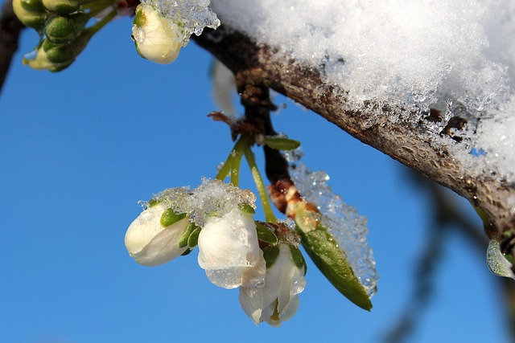

***                                                                              Helada en floración de ciruelos***

### Presión

Otro elemento determinantes para determinar la climatología de una zona es la presión atmosférica. La presión atmosférica es el peso de la masa de aire por cada unidad de superficie. Hay dos parámetros que influyen en el aumento o disminución de la presión:

- **La altura**: la presión disminuye a medida que aumenta la altitud. En igualdad de condiciones habrá más presión en las partes bajas de una montaña que en las altas.

- **La temperatura****: ****la distinta distribución de las radiaciones solares provoca un calentamiento zonal de la superficie terrestre con variaciones de presión. **

¿Y por qué influye la presión sobre el clima? Pues porque las diferencias de presión atmosférica entre distintos puntos de la corteza terrestre hacen que el aire se desplace de un lugar a otro, originando los vientos.

La presión atmosférica a nivel del mar (altitud 0) es de 1.013 mb. Las zonas donde la presión es superior a esta cifra las denominaremos zonas de altas presiones, y en ellas se dan los climas secos y las zonas donde las presiones son inferiores, serán zonas de bajas presiones con climas húmedos.

Si unimos los puntos de igual presión en un mapa por medio de una línea (isobaras), tendremos una representación de las presiones atmosféricas de una zona, son los “campos de presiones”. En estos mapas las zonas con más bajas presiones se representan con una (B) y las llamamos depresiones o borrascas y las zonas de altas presiones las representamos con una (A) y las llamamos anticiclones.

Las borrascas están formadas por masa de aire frío y los anticiclones por masa de aire caliente, la alternancia de borrascas y anticiclones nos marcan los distintos tipos de tiempo. El descenso de la presión es síntoma de mal tiempo y el ascenso de tiempo despejado.

### Humedad atmosféricas

El tercer factor que vamos a estudiar como condicionante fundamental del clima es la humedad atmosférica.

La humedad atmosférica nos va a indicar la cantidad de vapor de agua presente en el aire. Al vapor de agua lo podríamos considerar como un gas invisible que forma parte de la atmósfera.

Normalmente cuándo se habla de humedad atmosférica hablamos en términos de humedad relativa. La humedad relativa se expresa en forma de tanto por ciento (%) de agua en el aire. El 0 % de humedad significa que no hay vapor de agua, el 100% de humedad significa que existe tal cantidad de vapor de agua en la atmósfera que el aire no puede contener más, se dice que está saturado, el agua líquida que hubiera en ese momento en la atmósfera no puede evaporarse por lo que se forman minúsculas gotitas que mojan el suelo o forman gotitas de niebla.

La humedad relativa aumenta al disminuir la temperatura, por lo que los valores mayores de humedad relativa se dan durante el invierno y los más bajos en verano, esta diferencia estacional es más acentuada en las zonas interiores de la Península pues en las zonas costeras la humedad suele permanecer alta durante todo el año.

La humedad relativa suele variar entre el 20% en los días extremadamente secos y el 100 % en los días de niebla o lluvia continua. La **saturación** es el punto a partir del cual una cantidad de vapor de agua no puede seguir creciendo y mantenerse en estado gaseoso, sino que se convierte en líquido y se precipita.

## METEOROS

Los fenómenos meteorológicos o meteoros los podemos clasificar como los elementos más visibles que nos indican los fenómenos físicos naturales que se dan en la atmósfera. Entre ellos se encuentran las nubes, el viento y la lluvia y surgen como resultado de la combinación de los distintos elementos climatológicos que hemos visto.

Las nubes se forman por la condensación del vapor de agua (humedad relativa) que hay en una masa de aire en la atmósfera en un momento dado, que esta masa de aire se mueva o se esté quieta va depender fundamentalmente de las variaciones de presión atmosférica que se producen a su alrededor, el vapor de agua se evapora y condensa por variaciones de temperatura. Si la temperatura, la humedad y la presión son los elementos fundamentales que van a determinan el clima; el viento, las nubes y las precipitaciones son los fenómenos físicos que más fácilmente vamos a apreciar.

### Nubes

Para simplificar un poco diremos que la mayoría de las nubes tienen su origen en corrientes de aire ascendente, el aire se enfría al elevarse y el vapor de agua que contiene acaba por formar una masa nubosa. Las nubes están formadas por millones de gotitas de agua microscópicas, como las que forman cuando tapamos una olla y ponemos a hervir.

La mayoría de los nombres de nubes contienen prefijos y sufijos latinos que, al combinarse, dan una indicación del tipo de nube. Algunos de ellos son los siguientes:

- Stratus/estrato: alargado, allanado y nivelado. Nubes estratificadas.

- Cumulus/cúmulos: montón, colmo. Nubes de desarrollo vertical.

- Cirrus/cirro: plumoso, fleco. Nubes de cristales de hielo.

- Nimbus/nimbo: portador de lluvia, capaces de formar precipitaciones

- Alto: nivel medio

Las nubes altas suelen formarse por encina de los 5.000 metros; las nubes medias se suelen formar entre los 2.000 y los 7.000 metros; y las nubes bajas suelen formarse a una altura máxima de 2.000 metros.

La Organización Meteorológica Mundial clasifica las nubes en diez tipos principales:

#### CIRROS

Nubes separadas, en forma de filamentos blancos y delicados, de aspecto fibroso o sedoso, o ambas cosas a la vez, formadas por cristales de hielo, que le dan su peculiar aspecto. Cuando se presentan aislados son síntoma de buen tiempo, pero si avanzan organizados y aumentando progresivamente indican un cambio inminente del tiempo: algún frente o borrasca se aproxima.

#### CIRROCÚMULOS

Capa delgada de nubes blancas, sin sombras propias, compuesto de elementos muy pequeños en forma de gránulos, mezclados o separados, dispuestos más o menos regularmente (a veces según bandas que cruzan el cielo, dándole aspecto de “cielo aborregado”).

Salvo si aumentan considerablemente con el paso del tiempo, no suelen indicar cambio de tiempo. Otras veces aparecen asociados a corrientes en chorro a gran altura.

#### CIRROSTRATOS

Género de nubes en forma de velo blanquecino y transparente, de estructura fibrosa o lisa, que cubren de modo total o parcial el cielo. Este tipo de nubes suele producir un halo solar o lunar.

Los cirrostratos suelen anunciar cambios, se acerca un frente cálido y aumentan su espesor según este avanza.

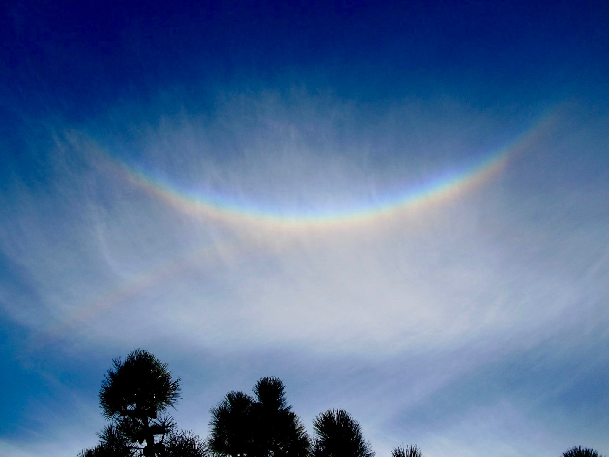

#### ALTOCÚMULOS

Capa de nubes blancas o grises, o de ambas tonalidades a la vez, con sombras propias, y compuesto por láminas, masas redondeadas, rodillos, etc., que pueden estar unidas o no, y de aspecto a veces difuso.

Los altocúmulos aislados son indicadores de buen tiempo. Cuando van en aumento o mezclados con altostratos indican la proximidad de un frente o una borrasca, y en tales casos pueden desprender precipitaciones débiles.

#### ALTOSTRATOS

Capa nubosa, grisácea o azulada, con aspecto estriado, que cubre el cielo total o parcialmente, presentando partes delgadas que permiten ver vagamente el Sol.

Están asociados a frentes cálidos y suelen dejar lluvias débiles continuas.

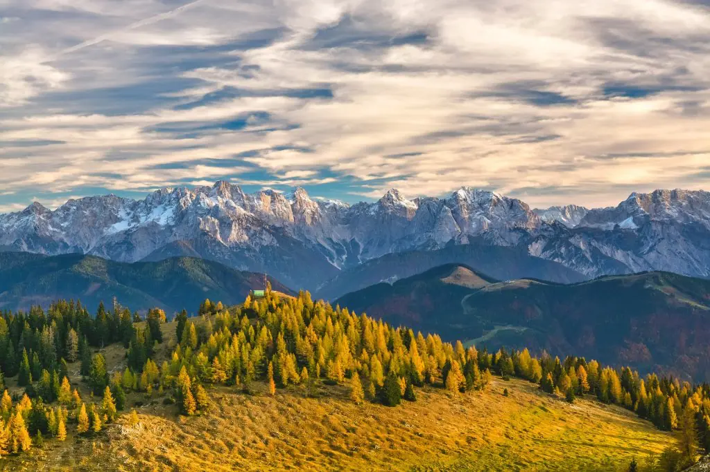

#### NIMBOSTRATOS

Nubes densas de color gris oscuro, cuyo aspecto se hace difuso por la caída de precipitación. El notable espesor en todas sus partes oculta la visión del Sol. Están asociados a los frentes cálidos y suelen ocasionar lluvias continuas.

#### ESTRATOCÚMULOS

Manto de nubes grises o blancas, o de ambos colores a la vez, que tienen casi siempre partes oscuras, y con forma de pesados rodillos o masas globulares alargadas, de aspecto no fibroso, y dispuestas según largas bandas paralelas que cubren todo o gran parte del cielo.

No indican cambios de tiempo y se asocian al buen tiempo cuando en verano aparecen a media tarde.

#### ESTRATOS

Capa nubosa gris y uniforme, sin forma particular, ni estructura, que por lo general cubre completamente el cielo.

Cuando producen nieblas suelen estar asociados a tiempo anticiclónico. Si aparecen debajo de los altostratos o nimbostratos se asocian a un frente cálido y pueden dejar lloviznas.

#### CÚMULOS

Nubes aisladas, por lo general densas, y de contornos bien delimitados, que se desarrollan verticalmente en forma de torres con forma de coliflor. Estas nubes suelen ser de un blanco brillante arriba y algo oscuras en su base, casi perfectamente horizontal.

Los cúmulos corresponden al buen tiempo cuando hay poca humedad ambiental y poco movimiento vertical del aire. En el caso de existir una alta humedad y fuertes corrientes ascendentes, los cúmulos pueden adquirir un gran tamaño llegando a originar tormentas y aguaceros intensos.

#### CUMULONIMBOS

Nubes densas y grandes, de gran desarrollo vertical, en forma de torres gigantescas, cuyo extremo superior es liso o fibroso, y casi siempre achatado con forma de yunque.

Producen casi siempre tormenta con precipitaciones en forma de lluvia o granizo.

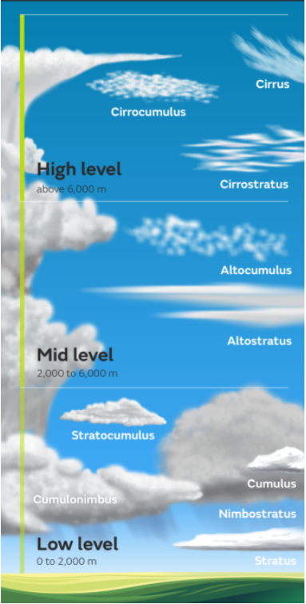

### Precipitaciones

Las nubes están formadas por pequeñas gotas microscópicas. La mayoría de las veces la lluvia se forma en nubes que están en zonas altas de la atmósfera donde se dan bajas temperaturas lo que hace coexistir pequeños cristales de hielo con las gotas microscópicas. Las gotitas microscópicas se van uniendo a los cristales de hielo haciéndose cada vez más grandes, al ser cada vez más grandes pesan más y tienden a caer, al ir descendiendo aumenta la temperatura en la atmósfera y los cristales de hielo se transforman en lluvia. Pero dependiendo de la temperatura y el grado de condensación, el agua que generalmente precipita en forma de lluvia líquida, también puede hacerlo en forma de cristales de hielo (nieve) o de masas densas de hielo de diverso tamaño (granizo).

Tipos de precipitación más característicos son:

- **Llovizna****: también conocida como orballo, sirimiri o calabobos. Está formada por numerosas y finas gotas de agua de diámetro inferior a medio milímetro. La velocidad de caída es tan lenta que parecen flotar en el aire. Proceden típicamente de las nubes tipo estratos.**

- **Lluvia****: es la forma más común de precipitación. Las gotas tienen un diámetro de más de medio milímetro y caen con velocidad moderada. Procede casi siempre de los nimboestratos y altoestratos.**

- **Chubascos****: pueden ocasionar tormentas. Las gotas de agua son grandes. La precipitación es intensa, discontinua y ocasional. Si es torrencial puede provocar grandes inundaciones. Los chubascos pueden ser de nieve si la temperatura es inferior a cero grados. La únicas nubes que los producen so****n**** los cumuloninmbos. **

- **Nieve****: está formada por conglomerados de cristales de hielo en su mayor parte ramificados (a veces con forma de estrellitas hexagonales) que se sueldan formando copos. Cuando la nieve se funde ligeramente, se habla también de aguanieve.**

- **Granizo****: son granos de hielo redondeados y translúcidos. El diámetro varía entre 5 y 50 milímetros y caen, al igual que los chubascos, en un corto período de tiempo. Sólo los producen los cumulonimbos.**

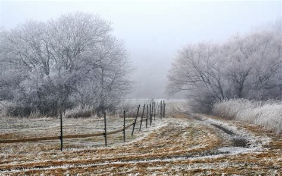

### Viento

El viento es el desplazamiento que sufren las distintas masas de aire de la atmósfera. Las masas de aire se mueven para intentar igualar la presión atmosférica a la que se hayan sometidas.

El viento es la circulación del aire de un lugar a otro, con más o menos fuerza. Transporta las masas de aire con unas determinadas características de temperatura y humedad de un lugar a otro. Su principal efecto es mezclar distintas capas o bolsas de aire, esto influirá decisivamente en el tiempo que tendremos. Cuando se concentra la humedad en una zona y esta asciende hasta una capa de aire más fría, se producen las precipitaciones.

Debido a la situación y la orografía hablamos de vientos regionales, como por ejemplo:

- **Ábrego****: viento templado y húmedo del suroeste en ambas Castillas, Extremadura y Andalucía con temporal persistente de lluvia. En Cantabria es conocido como viento castellano, mientras que en Asturias se denomina aire de las castañas, ya que cuando sopla con fuerza provoca la caída de este fruto.**

- **Bochorno****: viento del sureste y procedencia mediterránea, que entra por la desembocadura del Ebro y sube río arriba. Es un viento seco, cálido y agobiante en verano; suave, templado y húmedo durante otoño y primavera.**

- **Cierzo ****o mistral****: viento frío y seco del noroeste, de esos que penetran los huesos, y que sopla con frecuencia en el Valle del Ebro.**

- **Galerna****: viento con un salto brusco del suroeste al noroeste que se presenta en el Golfo de Vizcaya y Costa Cantábrica, con intenso temporal en el mar.**

- **Gallego****: viento del noroeste en el Duero que sopla frío y racheado.**

- **Levante****: posiblemente sea el que más nos suene. Es un viento del este que sopla en la costa mediterránea española. El origen del viento de levante está en el Mediterráneo central, en zonas cercanas a las islas Baleares. Alcanza su mayor velocidad en el Estrecho de Gibraltar, donde deja lluvias en la vertiente este de las sierras gaditanas, antes de bajar muy seco, ya descargado de humedad, y con altas temperaturas a lo largo de la vertiente oeste.**

- **L****lebeig****:**** viento del suroeste que sopla en las costas del sur Mediterráneo y trae normalmente polvo en suspensión procedente del Sáhara. Su aparición se asocia a la llegada de tormentas y lluvias.**

- **Poniente****: viento del oeste húmedo y templado que entra por las costas portuguesas y arrastra las borrascas atlánticas, con sus sistemas nubosos, hacia el interior de la Península. A medida que avanza va perdiendo humedad y aumentando de temperatura, llegando finalmente a la costa levantina como un viento seco y cargado de calor.**

- **Siroco****(Xaloc)****: ****e****ste viento del sureste afecta a Valencia, Cataluña y Baleares. Es muy cálido y suele arrastrar calima del Sáhara.**

- **Tramontana****: viento frío y turbulento de componente norte, que sopla especialmente en la comarca del Ampurdán (nordeste de Cataluña) y en las islas Baleares. En ocasiones puede llegar a alcanzar velocidades próximas a los 200 km/h.**

- **Gregal****: Viento frío y seco de compon****ente noreste característico de las islas Baleares.**

Llamamos **viento dominante** a los vientos que soplan con mayor frecuencia en una zona. Sobre la velocidad del viento a lo largo del día, por lo general, el viento es más fuerte de día y más flojo durante la noche. Presenta una máxima velocidad durante las primeras horas de la tarde, y el mínimo a la salida del sol, el viento esta en mayor calma por la noche que durante el día, a la salida del sol. Esto es así en alturas inferiores a 1.000 m, sobre colinas y montañas que se producen otros efectos.

En agricultura los problemas asociados al viento son, entre otros, la pérdida de suelo debido a la erosión eólica, daños en las estructuras de las plantas (rotura de ramas, arqueo de troncos), problemas de polinización por vientos fuertes, daños en infraestructuras agrarias (rotura de plásticos de invernadero, sistemas de riego…) ¿Y qué podemos hacer? Diseño de plantaciones teniendo en cuenta la dirección del viento dominante colocación de tutores para corregir desviaciones de tronco, sistemas de poda que permitan circulación del aire, colocación de cortavientos, de material vegetal o inerte.

## APARATOS DE MEDIDA DE VARIABLES CLIMÁTICAS

### Termómetro

Para medir la cantidad la **temperatura** se utiliza el termómetro. El termómetro más conocido es el de mercurio que basa su funcionamiento en la contracción y expansión que experimente el mercurio encerrado en un tubo de cristal calibrado, los termómetros de máxima y de mínima dejan marcados los puntos de temperatura más alta y más baja durante cualquier periodo. Aunque en la actualidad la mayoría de los termómetros son de uso digital, los más utilizados en Agricultura son los termómetros de infrarrojos que constan de un sensor que se pone en contacto con la superficie del cuerpo que queramos registrar la temperatura, bien sea el suelo o partes del vegetal. La temperatura del aire se suele medir en grados centígrados.

*	Termómetro de max y min			termómetro digital		**T**ermómetro infrarrojos*

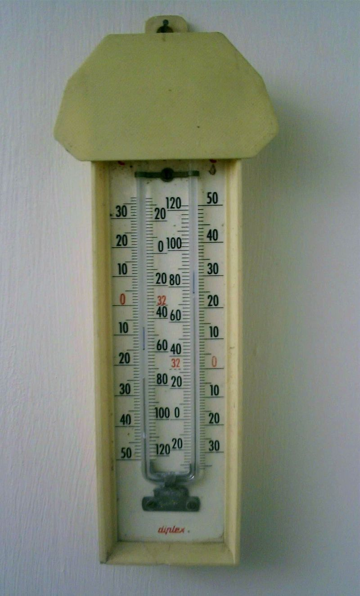

### Barómetro

Para medir la **presión** utilizamos el barómetro. Hay dos tipos: los de mercurio y los aneroides.

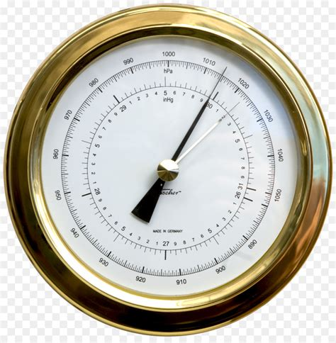

*	Barómetro d**e** mercurio						**Barómetro aneroide*

### Higrómetro

Para medir la **humedad** se utiliza un instrumento llamado higrómetro. Actualmente se utiliza el higrómetro digital. Este modelo realiza los cálculos a través de circuitos electrónico con los cuales se logra expresar en números las pequeñas alteraciones de tensión que son producidas por la variación de algunas propiedades físicas, mediciones que se pueden observar en la pantalla.

### Pluviómetro

Para medir las precipitaciones se usa el pluviómetro, hay muchísimos tipos de pluviómetros pero básicamente todos utilizan el mismo sistema, es un recipiente de forma cilíndrica graduado y que recoge el agua de lluvia caída.

### Anemómetro y veleta

La velocidad del viento se mide con un anemómetro y la dirección del viento con la veleta.

El anemómetro es un aparato que juega un rol importante dentro del área de la meteorología, permitiendo medir la intensidad del viento. Los más comunes se componen de un sistema de pequeñas aspas y en sus extremos pequeñas cuencas las cuales se les permite oscilar, cuando el viento sopla esta gira y de esta forma arroja los resultados en el dispositivo. La veleta es un dispositivo giratorio que consta de un placa que gira libremente, un señalador que indica la dirección del viento y una cruz horizontal que indica los puntos cardinales.

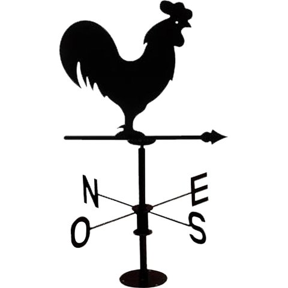

Las distintas escala s de viento dependiendo de la velocidad son:

**			****E****SCALA DE VIENTO**

Calma		Temblor de hojas- ramas pequeñas se agitan.	6 – 20 Km/h

Moderado	Las ramas grandes se mueven.			21 – 40 Km/h

Fuerte		Los árboles se agitan.				41 – 70 Km/h

Muy fuerte	Ramas arrancadas,- árboles arrancados.		71 – 120 Km/h

Huracanado	Árboles arrancados, destrucción instalaciones	> 120 Km/h

### Estaciones meteorológicas

Una estación meteorológica es el lugar en el que se realizan observaciones del comportamiento de la atmósfera y del medio ambiente. La recopilación de datos emitidos por el instrumental meteorológico y su posterior análisis y estudio permitirán la realización de un diagnóstico de la situación atmosférica en un momento dado.

La ubicación de las estaciones es un aspecto muy importante para que la toma de datos sea correcta. La estación no puede estar en cualquier sitio. Ha de estar en terreno llano con césped y sus alrededores deben estar libres de obstáculos.

En una estación tipo tenemos tres elementos básicos: veleta y anemómetro para la medición del viento, el pluviómetro para medir las precipitaciones y la garita o caseta meteorológica. En su interior situaremos los termómetros de máxima y mínima, el psicrómetro/higrómetro y el termohidrógrafo.

Se recomienda que las garitas sean de madera, bien ventiladas, pintadas e blanco y esmaltadas para reflejar la radicación. El techo debe tener inclinación para escurrir el agua de la lluvia y la nieve y ha de ser doble, con circulación del aire entre ambos para evitar el calentamiento del aire cuando la radicación sea muy intensa. La puerta debe estar orientada al norte, para evitar que los rayos del sol toquen los instrumentos cuando realizamos las observaciones.

## MAPAS METEOROLÓGICOS

Las previsiones del tiempo se logran a a través de:

- **Recogida de datos en el planeta****: Alrededor de 10.000 estaciones meteorológicas en la Tierra, dividiéndose en globos sondas, embarcaciones y aviones de línea regular, boyas oceanográficas, satélites, etc.**

- **Modelo****: Potente programa informático que analiza profundamente todas las mediciones. Es capaz de generar mapas de temperatura, lluvia, presión, humedad.**

- **Predictores****: Interpretación de los datos recogidos y los valores del modelo.**

La predicción clásica no ofrece resultados fiables más allá de los 7 u 8 días. En plazos mayores se utiliza la previsión estacional que estima la tendencia en periodos lluviosos, calurosos o secos. Los mares anormalmente cálidos acaban produciendo lluvia sobre los continentes próximos, las grandes masas oceánicas tienen mucha más inercia térmica que la atmosfera siendo previsibles con varios meses de antelación. En la práctica se utilizan modelos climáticos que simulan a la vez el océano, atmósfera y los intercambios entre ambos.

**INTERPRETACIÓN DE MAPAS METEOROLÓGICOS:**

En un mapa del tiempo deberíamos aprender a interpretar la presión atmosférica, los vientos dirección e intensidad, la posición de los frentes, en fin saber si vamos a tener “buen tiempo ó mal tiempo”, según las necesidades de nuestro trabajo.

Los mapas meteorológicos han sufrido una larga variación a lo largo de la historia, desde simples representaciones en dibujos a los actuales que se realizan con potentes ordenadores donde se hacen recreaciones de posible tiempo a venir tienen una simbología determinada para que puedan ser interpretados uniformemente. Vamos a ver unas pequeñas pautas por si queremos interpretar un mapa del tiempo. Los datos que aparecen en un mapa meteorológico típico son:

- ***El viento*****:** Se desplaza desde zonas de alta presión a zonas de baja presión. La flecha con la que suele representar suele indicar la dirección desde donde sopla y la intensidad se muestra con el número de rayitas perpendiculares

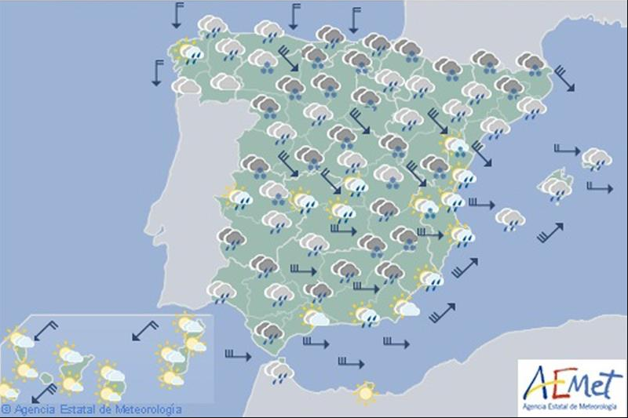

- ***Presión atmosférica******:****** Las ******isobaras****** son las líneas que aparecen en los mapas meteorológicos, uniendo los puntos de igual presión, como líneas de contorno de las áreas de alta y baja presión. Es interesante saber que cuanto más cercanas están las isobaras, más intenso es el viento. Baja presión, significa temporal, mal tiempo y lluvia, en los mapas de isobaras veremos la B de Bajas Presiones, lo que podremos asociar intuitivamente a B de Borrasca. Altas presiones, buen tiempo y ausencia de nubes, relacionaremos la A que aparece en la línea del tiempo con lo que se podrá asociar igualmente a A Anticiclón.***

- ***Áreas de alta y baja presión******:****** Designadas simplemente con una A azul o una B roja en mayúsculas grandes. ***

- ***Temperatura******: A menudo se incluye la temperatura en la superficie, las cifras que indican suelen corresponderse con la máxima y mínima.***

- ***Nubosidad******: Se relaciona con la presencia de nubes o no. Como ya se ha indicado cada medio de comunicación utiliza un icono para realizar la representación gráfica de las siguientes características: Soleado, parcialmente soleado, parcialmente nublado, nublado y cubierto (la escala puede ser mayor mayormente soleado, mayormente nublado, etc.).***

- ***Áreas de precipitación******: Hay un símbolo convencional, que es la que generalmente se usa, para cada tipo de precipitación: lluvia, llovizna, nieve, niebla, chubasco y tormenta eléctrica. Sitúan el símbolo sobre la zona geográfica donde se prevea.***

- ***Frentes******: Los frentes fríos, son masas de aire frio, aparecen como una línea azul gruesa con flechas (triángulos) delante de ellos, indicando de ese modo la dirección en la que se mueve. Los frentes cálidos, son masas de aire caliente, son representados con una línea roja gruesa, con semicírculos a lo largo del borde que avanza, indicando el sentido en el que se desplaza. Los frentes estacionarios se representan con una línea que alterna semicírculos rojos de un lado y triángulos azules del otro y los frentes ocluidos aparecen como líneas que alternan triángulos azules y semicírculos rojos del mismo lado de la línea.***

## INFLUENCIA DE LAS ACTIVIDADES AGROPECUARIAS EN EL CLIMA

Todas las ramas de la actividad agroforestal, y ganadera van a verse afectadas directamente por el cambio climático, a la vez se puede decir que la agricultura y la ganadería son también causantes de estos cambios.

El hecho es que determinadas actividades humanas están provocando este cambio climático. La concentración de gases como el dióxido de carbono, el metano, el óxido nitroso, etc. ha aumentado (más del 30% durante el último siglo), lo que contribuye a un calentamiento global del clima.

En general, se denomina “efecto invernadero” al aumento de la temperatura global de la Tierra debido a la acumulación de gases. Efecto invernadero y calentamiento global son dos conceptos que van de la mano. Y es que lo segundo es consecuencia de lo primero.

### Efecto invernadero

En la atmósfera siempre han existido distintos gases que atrapan el calor del sol irradiado por la tierra y lo reflejan actuando como una sábana alrededor de ella. Éstos mantienen la temperatura de la tierra lo suficientemente caliente para posibilitar la vida humana. Estos gases en nuestra atmósfera se conocen como ‘gases de efecto invernadero’, y siempre han estado ahí, sin embargo, en los últimos 150 años, los seres humanos hemos estado quemando combustible para fábricas, vehículos, actividades profesionales, y hogares a una velocidad cada vez mayor. Esto ha aumentado la cantidad de gases de efecto invernadero presentes, especialmente el dióxido de carbono, lo que ha dado como resultado temperaturas en continuo aumento en la atmósfera de la tierra, que a su vez provocan ‘el calentamiento global’ y el cambio climático.

Los gases de efecto invernadero (GEI), son aquellos que dejan pasar la radiación del sol, pero que absorben las radiaciones infrarrojas devueltas por la superficie terrestre, a las que impiden escapar hacia el espacio.

Algunos científicos han previsto que para el año 2100, la tierra podría estar entre 1.4°C y 5.8°C más caliente que en 1990. Esto dependerá fundamentalmente de la toma o no de acciones para disminuir la emisión de gases efecto invernadero de los distintos países, sobre todo de los más contaminantes.

Consecuencia que puede tener todo esto:

- En España se ha contrastado que durante el siglo XX la media de las temperaturas máximas ha subido un grado. (En el Ártico se estima que 5 ºC). Si la temperatura de los océanos se vuelve más cálida, las tormentas son más intensas. En las últimas décadas, la gravedad y número de ciclones, huracanes y tormentas han aumentado.

- El nivel del mar ha crecido de 10 a 12 cm durante el mismo periodo de tiempo. Cuando la temperatura de la superficie se calienta, se produce la fusión del hielo de los glaciares y aumenta la cantidad de agua que desemboca en los océanos de todo el mundo.

- Cambios en el régimen de lluvias, en la Península Ibérica disminuyeron un 23 % durante el siglo XX. La escasez de agua disminuye la producción mundial de alimentos.

- Especies vegetales y animales silvestres se han desplazado hacia latitudes más extremas y han variado sus fases reproductivas. Plantas y animales mueres o se trasladan a otros hábitats (no nativos), cuando los ecosistemas de los que dependen para sobrevivir se ven amenazados.

Este cambio climático traerá asociado una serie de problemas que en el sector agropecuario se reflejaran como:

- Cambios de precipitaciones estacionales. Que nos obligan a adaptar otros calendarios de siembra y especies.

- Aumento de demanda de agua sur y sureste península, disminución de recursos hídricos.

- Cambios climáticos extremos, sequías, inundaciones que complicaran el manejo de los cultivos.

- Cambios en la biología de plagas y enfermedades dificultaran su manejo.

- Aumento de zonas áridas y semiáridas, aumento de zonas de erosión.

### Gases del efecto invernadero

Los gases del efecto invernadero son:

- ***El vapor de agua ******(H2O)**** es el principal gas invernadero. A él le debemos que la Tierra no esté congelada. El vapor de agua (H2O) **se produce** por la evaporación del agua. **Es el más abundante y contribuye a incrementar el efecto invernadero, pero es un gas de vida **de vida corta ya que** se condensa y precipita.  **Este gas es el único en que los humanos no tenemos influencia de modificar sus concentraciones por nuestras actividades.*

- ***Dióxido de carbono (CO2)******: es el ******gas ******que más se asocia a actividades humanas, y el principal responsable de******l efecto invernadero******. La concentración en la atmósfera se debe ******a la respiración de los seres vivo, la descomposición de la materia orgánica muerta, ******al uso de combustibles fósiles para procesos industriales y medios de transporte, erupciones volcánicas o los incendios forestales.***

- ***Metano (CH4)******: ******El metano se ******produce por la descomposición de materias orgánicas, cultivos como el arroz y en los rumiantes durante su proceso digestivo. También se produce por los escapes de depósitos naturales y conducciones industriales. Su potencial de calentamiento global es muy alto: cada kilo de metano calienta la Tierra 25 veces más que la misma masa de CO2. Eso sí, su presencia en la atmósfera es mínima en comparación con el CO2.***

- ***Óxido nitroso (N2O)******: ******g******as de efecto invernadero provocado principalmente por el uso masivo de fertilizantes nitrogenados en la agricultura intensiva. También lo producen otras fuentes como las centrales térmicas, los tubos de escape de automóviles y los motores de aviones, la quema de biomasa ******y ******también durante el tratamiento de aguas residuales.***

- ***Gases fluorados******: *****Son compuestos químicos artificiales, ****solo provienen de actividades relacionadas con el ser humano. comenzaron a usarse a principios de los 90 para sustituir a las sustancias que agotan la capa de ozono. Los gases fluorados son empleados, entre otras aplicaciones, como refrigerantes, agentes extintores de incendios, disolventes, ****producción de aluminio ****y ****para la fabricación de espumas aislantes e incluyen, entre otras, las siguientes sustancias: Hidrofluorocarbonos (HFC), Perfluorocarbonos (PFC), Hexafluoruro de azufre (SF6)****. ****S****e encuentran presentes en pequeñas concentraciones en la atmósfera pero son extremadamente potentes en el efecto invernadero que provocan. **

- ***El ozono troposférico (O3)*****. ****Primero vamos a diferenciar el “ozono bueno” del “ozono malo”. ****El ****ozono troposférico**** (el que se encuentra cerca de la superficie de la Tierra, entre el suelo y 19 km. de ****altura) es un contaminante que puede llegar a afectar a nuestra salud. Además, en la alta troposfera contribuye en gran medida al efecto invernadero. El ****ozono estratosférico**** (el que se encuentra en las capas altas de la atmósfera) nos protege de las radiaciones ultravioletas del sol. También originado por la quema de fuentes de energía contaminantes.**

### El CO2 y el metano

La agricultura moderna (intensiva) gasta una gran cantidad de energía en la producción y en el transporte. Esto significa un elevado consumo de petróleo y de otros combustibles, lo cual provoca una gran emisión de dióxido de carbono (CO2) y óxidos de nitrógeno, causantes, junto con el metano (CH4) producido por la ganadería, del aumento del efecto invernadero.

La agricultura y la ganadería son fuentes de emisiones de gases que contribuyen al efecto invernadero. Hay constancia de que el sector agropecuario contribuye al cambio climático con la emisión de gases de efecto invernadero, se considera que alrededor de un 15-20% de esto gases tienen su origen en las actividades agropecuarias. La gestión del estiércol generado en las granjas, el metano procedente por en los procesos digestivos de los rumiantes, los caballos y los cerdos, el cultivo del arroz, la quema de residuos agrícolas, la utilización de fertilización química, la deforestación para uso de tierras de cultivo son algunos ejemplos.

Una vaca adulta puede producir unos 500 litros de metano al día, cantidad que depende en gran parte de su dieta. El metano es un gas invernadero mucho más perjudicial que el dióxido de carbono, aunque su concentración en la atmósfera es relativamente baja. Pero está aumentando alrededor de un 5% anual. La manipulación de animales de granja y estiércol generan alrededor de la cuarta parte de las emisiones de mundiales de metano.

Si bien queda mucho trabajo por hacer para reducir las emisiones de los sectores mencionados anteriormente, hay varias actividades con las que se puede reducir las emisiones de la tierra y los cultivos, el ganado y la gestión del estiércol. Por ejemplo, los agricultores están fertilizando los cultivos con un mejor control del nitrógeno; demasiado nitrógeno puede contribuir a mayores emisiones de óxido nitroso sin mejorar la producción de los cultivos. Para el ganado, aumentar la calidad de los pastos ayuda a reducir la cantidad de metano emitido por unidad de producto animal. Realización de reforestaciones de tierras agrarias para que los nuevos árboles capturen el carbono (el dióxido de carbono se elimina de la atmósfera cuando lo absorben las plantas) etc.

Nosotros también podemos contribuir a reducir el efecto invernadero en nuestro planeta:

- Reducir, reciclar y reutilizar, si cada una de las personas reciclaran mas de la mitad de sus desechos domésticos, según el Instituto de Ecología (INECOL), se podría reducir la emisión de dióxido de carbono hasta un 60% cada año; te aconsejamos comprar productos de rehuso en lugar de desechables, como las botellas o contenedores de agua que son de materiales duraderos como el cristal o aluminio.

- Conducir menos tu automóvil, eso significa menos emisiones de dióxido de carbono porque se quema menos gasolina. Acciones como, revisar que tu automóvil esté funcionando de manera eficiente, compartir el coche, usar bicicleta y caminar, también generan beneficios en el medio ambiente.

- La vegetación es el medio principal que puede ayudar a equilibrar el efecto invernadero. Plantar árboles que absorben el dióxido de carbono de la atmósfera y a su vez, emiten oxígeno. Un árbol absorbe alrededor de una tonelada de dióxido de carbono en toda su vida útil. También se puede crear y hacer un jardín, este cumple el mismo propósito.

- Cuidemos los mares y océanos, no contaminar nuestro entorno ambiental es una forma brillante de cuidar nuestro planeta. Todas las especies marinas cumplen con la tarea de cuidar el medio ambiente, tal es el caso del pequeño fitoplancton en el océano, este absorbe grandes cantidades de dióxido de carbono y emite el doble oxígeno.

# FA_UD3_El suelo

FUNDAMENTOS AGRONÓMICOS

UD 3

EL SUELO

## EL SUELO

El suelo es un factor muy importante para el desarrollo de la vida y en nuestro caso, para la obtención de unas correctas producciones agrícolas, forestales o ganaderas.

### Propiedades

El suelo es una capa de material delgada y a menudo frágil, que recubre la parte externa de la corteza terrestre en ella se desarrollan las raíces de las plantas.

Está constituido por tres fracciones:

- **Fracción Sólida****: materia orgánica en descomposición y elementos minerales (arcilla, limo, arena, etc.). Ocupa el 50 % del suelo en volumen, correspondiendo un 5 % a compuestos orgánicos y un 45 % a compuestos minerales.**

- **Fracción Líquida****: es el agua que hay en el suelo. Ocupa parte de los espacios que existen entre las diferentes partículas de la fracción sólida. Cuando un suelo está inundado todos los espacios están ocupados por el agua, no habiendo espacio para el aire. Su contenido en el suelo es del 25 %.**

- **Fracción Gaseosa****: es el aire existente en el suelo. Ocupa los poros que no están ocupados por el agua. Su contenido en el suelo es también del 25 %.**

Las funciones más importantes que tiene un suelo son:

- Servir de anclaje para el sistema radicular de las plantas.

- Almacenar temporalmente parte del agua que está en el suelo y ponerlo a disposición de la planta.

- Aporta la aireación necesaria para que las raíces de las plantas se puedan desarrollar.

- Proporciona los nutrientes minerales que las plantas necesitan para su correcto desarrollo.

### Origen y formación

El punto de inicio para la formación del suelo o edafogénesis es la roca madre. Esta va a sufrir una serie de procesos, que la transformará total o parcialmente; suele comenzar con la ruptura de dicha roca en pequeñas partículas que nos darán los materiales del suelo. Estas transformaciones son muy lentas.

Los geólogos clasifican las rocas en tres grandes tipos: ígneas, sedimentarias y metamórficas.

- **Rocas ígneas****: son el material básico de la corteza terrestre, se han creado por el enfriamiento de los materiales fundidos de las profundidades de la tierra. El granito es una roca ígnea.**

- **Rocas sedimentarias****: se forman cuando el aire, agua, u otro agente depositan materiales, sedimentos, procedentes de la alteración en superficie de otras rocas, en las concavidades de los terrenos. Posteriormente estos sedimentes sufren proceso de compactación y cementación. Un ejemplo de rocas sedimentarias son las rocas calizas.**

- **Rocas metamórficas****: cuando a cualquier tipo de roca se le somete a altas presiones o temperaturas parte de sus minerales sufren transformaciones que originaran un nuevo tipo de roca. Un ejemplo característico son las pizarras ****y mármoles.**

La formación del suelo depende de cinco factores:

**La naturaleza de la roca original****:** Dependiendo de la composición inicial de los minerales que la forman, se realizará un tipo distinto de meteorización o descomposición de de las rocas. Según estos materiales iniciales, tendremos las distintas propiedades físicas y químicas de los suelos.

**El clima: **Influye directamente mediante la humedad y la temperatura e indirectamente mediante ella vegetación. Sin temperatura y humedad no se puede formar suelo. El clima es el principal agente de alteración química del suelo (meteorización química) y de la fragmentación física (meteorización física).

**El relieve del terreno****: **Condiciona el desarrollo del suelo en cuanto a profundidad y drenaje. Los relieves escarpados dan suelos sueltos y poco profundos y los relieves más moderados (valle) dan suelos más profundos.

**Los seres vivos****: **Condicionan los procesos químicos y físicos del suelo favoreciendo su fertilidad. La vegetación es clave en la formación del suelo por su acción de meteorización (musgos, líquenes, raíces…) y porque constituyen la principal fuente de materia orgánica del suelo. Los animales que viven en el suelo constituyen lo que se llama la fauna del suelo, son los responsables de  la alteración de la materia orgánica y de su mezcla con el mineral del suelo. La vida sobre y dentro del suelo incide directamente en su formación.

**El tiempo****: **Los procesos de formación del suelo son largos y su duración determina su cantidad y profundidad. Los suelos más antiguos son los que poseen mayores espesores y, por el contrario, los suelos más jóvenes son los de menos profundidad.

Todo suelo se origina a partir de una roca sólida, estos procesos de formación del suelo son largos.

El clima y las plantas son fundamentalmente los agentes trasformadores que convierten a la roca, en una pequeña capa de partículas fracturadas con alguna mezcla de materia orgánica en ella. A este proceso se le llama meteorización.

Se suele distinguir dos tipos de meteorización:

**La meteorización física**: se caracteriza por la fragmentación de la roca sin cambiar los minerales que la forman. Los factores determinantes son el agua, la temperatura y el viento. Un ejemplo es la meteorización producida por el aumento de volumen que se produce en el agua cuando se congela, el agua al quedarse retenida en las grietas de la roca madre y congelarse por la presencia de bajas temperaturas hacen que se parta. Otro ejemplo es la dilatación y contracción que sufre una roca por el calentamiento y enfriamiento de su superficie debido a la oscilación térmica. La lluvia y el viento al golpear la superficie de la roca también generan erosión.

**La meteorización química** es la que altera la composición de la roca y la rompe. El proceso más simple es la solución. El agua de lluvia tiene un pH neutro y puede disolver lentamente los minerales de la roca, por otro lado se sabe que a veces la lluvia tiene un pH más bajo de lo normal “lluvia ácida” que acelera bastante más estos procesos.

Los organismos vivos de un suelo (microorganismos, hongos, líquenes, plantas, animales, hombre, etc.), favorecen la meteorización química y física.

Meteorización para niños:

## EL PERFIL DEL SUELO

Un suelo, una vez formado, va cambiando a lo largo del tiempo. Va a experimentar una serie de procesos que le harán acumular materiales en distintas profundidades.

Los procesos que se pueden producir son:

- ***ADICIONES******: materiales caídos, ramas, hojas, sustancias ******o parículas****** transportadas por el aire que se añaden al suelo.***

- ***PÉRDIDAS******: los materiales se pierden al ser arrastrados a zonas más profundas o arrastrados en superficie a otros lugares.***

- ***D******ESPLAZAMIENTOS******: movimientos de materiales dentro del suelo, pero sin dejar de formar parte de él.***

- ***T******RANSFORMACIONES******: los materiales son alterados, existe meteorización de los minerales y putrefacción de la materia orgánica.***

Cada uno de estos procesos ocurre de forma diferente en profundidades diferentes. Por ejemplo, la materia orgánica suele ser agregada en las capas superficiales y los materiales del suelo de menor tamaño como las arcillas son movidos de arriba a bajo depositándose en posiciones inferiores. Como se puede observar estos cambios se producen a distintas profundidades, por lo que se van a generar capas horizontales.

**El perfil del suelo es un corte vertical en el terreno,** que va desde la superficie del suelo hasta la roca madre, a partir de la que se ha formado. En todo perfil, salvo casos excepcionales, se pueden distinguir una serie de capas horizontales llamadas horizontes, en algunos suelos se diferencian claramente los horizontes principales, en otros no existe una diferencia clara.

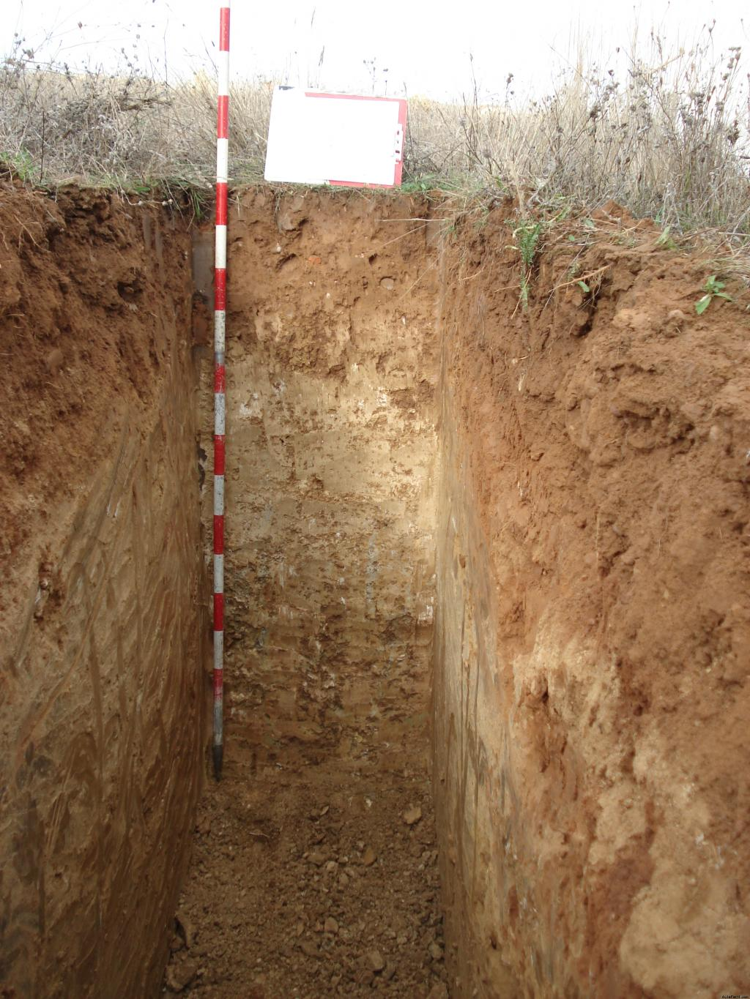

### Horizontes y tipos

Las distintas capas del perfil del suelo se llaman horizontes, se distinguen entre sí por sus características (color, contenido de partículas, etc.) Se pueden distinguir las siguientes:

- **Horizonte orgánico O**: contiene la mayor parte de los microorganismos del suelo.. Aquí se encuentran los restos vegetales y animales que dan lugar a la materia orgánica. Su color suele ser marrón oscuro debido a la presencia de dicha materia.

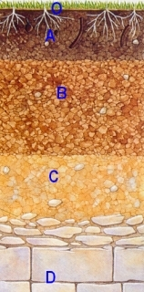

- **Horizonte A****: es el que ha sufrido los efectos del clima durante más tiempo. ****Abarca hasta donde alcanzan las labores ordinarias de arado, en el se sitúan las raíces de la mayor parte de las plantas herbáceas. ****Abundan el humus y raíces de plantas. La lluvia exporta los materiales más finos hacia las capas inferiores, por lo que está formado por materiales ****más ****gruesos.**

- **Horizonte B****: ****en este horizonte se encuentran las raíces más profundas. En él s****e depositan los materiales arrastrados desde el horizonte A. Es rico en arcilla y tiene menor cantidad de materia orgánica que el horizonte A. Su porosidad es pequeña.**

- **Horizonte C****: ****está formado por rocas más o menos alteradas que sirven de soporte a los dos horizontes anteriores. E****s la roca madre disgregada.**

- **Horizonte R****: roca madre.**

En algunos suelos se diferencian claramente los horizontes principales; en otros, en cambio, no existe una diferenciación clara o no existen. La aparición de estos horizontes varía en función de las condiciones edáficas, climáticas y topográficas de la zona. Por ejemplo, en zonas altas de montaña es frecuente encontrarnos un pequeño horizonte orgánico y justo debajo la roca madre, sin horizontes A, B y C.

En jardinería se trabaja fundamentalmente con el primer horizonte: el horizonte orgánico. Su profundidad varía mucho de unas zonas a otras, pero en jardinería lo más habitual es actuar sobre los primeros 30 cm del suelo, que es donde se va a desarrollar gran parte del volumen de raíces de las plantas cultivadas y se tiene la mayoría de la maquinaria necesaria. En trabajos agroforestales cuando se trabaja con árboles también se ha de tener en cuenta el subsuelo (formado por los horizontes A, B y/o C) ya que las raíces de los árboles profundizan más de esos 30 cm. Si este subsuelo tiene propiedades físicas desfavorables, como por ejemplo un mal drenaje, se deberá tener en cuenta para corregir esas deficiencias durante la preparación del terreno, antes de la implantación.

## PROPIEDADES FÍSICAS DEL SUELO

Las propiedades físicas de un suelo son las características que un agricultor debería llegar a sentir o percibir. Es la parte mineral del suelo, estos componentes minerales son el resultado de la disgregación a lo largo de miles de años de la roca madre.

Estas propiedades son fundamentales para el crecimiento de las plantas porque van a condicionar el desarrollo de las raíces. Son la textura, estructura y porosidad.

### Textura

La textura es una característica que viene dada por la fracción sólida mineral del suelo. Se trata de la proporción en arcillas, limos y arena de un suelo. La principal diferencia entre estos tres elementos es su tamaño que nos dará pie posteriormente a su clasificación.

- **ARENA****: ****partículas minerales sólidas de tamaño entre 2 mm y 0,0****2**** mm. Constituyen la**** fracción del suelo más grande, está compuesta principalmente de granos de cuarzo, ****feldespatos, micas, ****etc, que son elementos muy comunes en la corteza terrestre.**** ****L****os granos de arena más grandes son visibles a simple vista. ****S****on areniscos al tacto y no se pegan los unos a los otros. Los suelos arenosos crean suelos con grandes poros, de modo que no retienen nutrientes ni agua favoreciendo la infiltración, son suelos bien aireados.**

- **LIMO****:**** es la fracción de suelo intermedia, ****comprendida entre 0,0****2**** y 0,002 mm. ****N****o es visible a la vista, su tacto es suave como el talco y no ****tienen capacidad de agregación****. ****Su composición química es semejante a la arena pero han ****sufrido una meteorización más intensa que ****estas**** y por ese motivo son más pequeñas. De todas las fracciones del suelo, el limo tiene la mejor capacidad para retener grandes cantidades de agua para ser usada por las plantas.**

- **ARCILLA****: ****constituyen la fracción de suelo más pequeña, ****menor de 0,002 mm. Es el componente más importante de la fracción sólida de un suelo. Las arcillas aparecen a causa de la meteorización química de la roca ****(****mientras que arena y limo son por causa de la meteorización física****)**** son un producto nuevo que no aparece en las rocas sin meteorizar, y producidas por el proceso de formación del suelo. ****Estos nuevos minerales ****tienen actividad física y química y ****pueden unir químicamente nutrientes a su superficie, reteniendo los nutrientes de la planta en el suelo. Las partículas de arcilla se pegan las unas a las otras y, por ello, no se comportan como granos individuales en el suelo. La arcilla mojada es normalmente pegajosa y puede ser moldeada.**

Las partículas mas gruesas son las gravas: tamaño oscila entre 2 y 7 mm. Mayores de 7 mm serían piedras.

**C****LASIFICACIÓN DEL SUELO POR ****SU ****TEXTURA**

Los suelos normalmente están formados por más de una fracción de suelo; las tres fracciones se encuentran en la mayoría de los suelos. La proporción exacta o el porcentaje de las tres se llama textura del suelo. Obviamente cualquier combinación de las tres es posible. Para simplificar, los científicos han creado una división que agrupa suelos similares, de esta forma han creado 12 clases de textura.

Para determinar la clasificación de la textura del suelo nos basamos en el triángulo textural o del suelo. Los datos que tenemos que tener claros son el contenido de arcilla, limo y arena de nuestro suelo. Estos datos los tenemos que tener referidos en %. Trazamos líneas cuyo punto de partida son los porcentajes de suelo de cada fracción y su dirección es la que se indica en el triángulo.

Ejemplo: un suelo con un 24 % de arena, 32 % de arcilla y 44 % de limo.

**Características de los suelos según su textura:**

- Los **suelos arenosos** se denominan suelos sueltos, de textura gruesa. Se caracterizan por tener una elevada permeabilidad al agua. Y por tanto una escasa retención de agua y de nutrientes. Son de fácil laboreo y de buena aireación que facilita el desarrollo de las raíces

- Los **suelos arcillosos** se denominan suelos pesados, de textura fina. Son plásticos, poco aireados, difíciles de labrar y retienen mucha cantidad de agua y nutrientes. Son suelos muy activos químicamente. Por su baja porosidad pueden convertirse en suelos impermeables y asfixiantes.

El contenido en arcilla en un suelo resulta mucho más determinante del comportamiento del mismo y de la respuesta de las plantas, que los restantes componentes. Debe haber unas tres veces más arena gruesa que arcilla para que el suelo tenga unas propiedades condicionadas por la arena, más que por la arcilla.

Entre la textura arenosa y la arcillosa se encuentran las otras 10 clases, con características intermedias entre ambas.

- La **suelos f****ranc****os** se considera la textura ideal, porque tiene una mezcla equilibrada de arena, limo y arcilla (arcilla 10-30 %, limo 30-50 % y arena 20-50 %) . Esto supone un equilibrio entre permeabilidad al agua y retención de agua y de nutrientes. Son los suelos mejor estructurados, lo que favorece los procesos físicos, químicos y biológicos del suelo.

- **D****ETERMINACIÓN DE LA TEXTURA DEL SUELO**

La cantidad de arena, limo y arcilla que tiene un suelo puede medirse de manera mecánica, sencillamente. Hay un método muy conocido el del cilindro.

**Método del «cilindro».**

Este método se basa en el hecho de que la arcilla es fácilmente moldeable, mientras que ni el limo ni la arena lo son.

Para realizar esta prueba tomaremos un puñado del suelo que queramos conocer entre las manos. Antes hemos eliminado los elementos gruesos (gravas, piedrecillas, restos vegetales…). Esta muestra debería tener la suficiente humedad como para que la sintiéramos; si no es así la deberíamos humedecer. Con este pequeño puñado intentaremos realizar un cilindro como mínimo de 3 mm de diámetro, siempre amasando la tierra entre las manos.

Dependiendo de si conseguimos o no hacer el cilindro, y la sensación que nos dé al tacto podremos saber de qué tipo es, siguiendo los criterios de esta tabla:

Clasificación del tipo de textura. «Método del cilindro»

SE PUEDE FORMAR UN CILINDRO DE 3 MM DE DIÁMETRO	TACTO				CLASE DE SUELO

NO					Arenoso.			Suelo arenoso.

NO					Suave				Suelo limoso.

NO				Entre suave y arenoso.			Suelo franco.

SÍ			Al intentar hacer un anillo se rompe.		Suelo franco-arcilloso

SI			Al intentar hacer un anillo no se rompe.		Suelo arcilloso.

### Estructura del suelo y porosidad.

La estructura representa la forma en que se unen las distintas partículas minerales del suelo constituyendo agregados, los cuales a su vez pueden asociarse entre sí formando los típicos “terrones”. De esta forma las partículas sólidas del suelo (arcilla, limo y arena) no se encuentran sueltas unas de otras, sino que generalmente se agrupan entre ellas formando agregados.

Al constituirse los agregados, las partículas más gruesas (arena y limo) actúan de esqueleto mientras que las más finas (arcillas y humus) sirven de cemento de unión, de tal forma que el humus y la arcilla forman el llamado complejo **arcillo-húmico**.

El humus es una sustancia que procede de la descomposición de la materia orgánica del suelo y su papel más importante es el de servir de cemento o pegamento entre las partículas minerales, permitiendo así que el suelo pueda tener estructura.

Si no hay una proporción de arcillas y materia orgánica, las partículas del suelo permanecen dispersas y los agregados no se terminan de formar.

Las partículas y los agregados de suelo constituyen “piezas” o elementos que no encajan entre sí como un puzzle evitando que el suelo se compacte y dejando espacios vacíos que pueden ser grandes (macroporos) y pequeños (microporos) que se comunican entre sí formando “canalillos” en el suelo, a través de los cuales circula el aire y el agua además de crecer por ellos las raicillas. Normalmente los poros más grandes son ocupados por aire y los más pequeños por agua.

En general cuando un suelo tiene una buena estructura se encuentra “mullido”, con poros grandes que permiten el paso del aire, del agua y de las raíces, y con poros pequeños capaces de retener agua y nutrientes.

Un suelo bien estructurado nos aporta:

- Buena penetrabilidad de las raíces.

- Buena capacidad de retención de agua.

- Buena capacidad de retención de aire.

- No se destruyen los grumos por el laboreo, por los impactos de las gotas de lluvia o por el agua de riego.

- Se labran bien.

- No forman costra.

- Son suelos fértiles, que retienen bien los nutrientes procedentes de abonados o de la mineralización de la materia orgánica.

**TIPOS DE ESTRUCTURAS:**

Hay varias formas de catalogar la estructura de un suelo. Las más importantes son:

**Según el grado de desarrollo**:

- **Fuerte****: agregados duraderos, son compactos y bien definidos, incluso cuando el suelo está seco. ****Ejemplo:**** En ****tierras de cultivo bien estructuradas****, donde la materia orgánica y las raíces ayudan a formar agregados duraderos. También en ****suelos arcillosos ricos en minerales****, que mantienen su estructura incluso después del secado.**

- **Moderada****: Los agregados son visibles y diferenciados, pero no tan resistentes como en la estructura fuerte. ****Ejemplo:**** Suelos agrícolas manejados con ****rotación de cultivos y abonos orgánicos****, donde se mantiene una buena estructura, pero con menor compactación que en los suelos de estructura fuerte.**

- **Débil****: Los agregados solo se pueden distinguir cuando el suelo está húmedo y se desmoronan fácilmente al secarse. ****Ejemplo:**** Un ****suelo franco o ligeramente arenoso****, donde la materia orgánica no es suficiente para mantener agregados firmes. También en terrenos agrícolas con ****exceso de labranza****, que pueden perder estructura fácilmente.**

- **Sin estructura****: agregados que no se distinguen por falta de aglomeración, como ocurre en los suelos arenosos. No se observan agregados definidos porque las partículas no están bien unidas. ****Ejemplo:**** Un ****suelo arenoso de una zona costera o desértica****, donde las partículas de arena no se aglomeran y el agua se infiltra rápidamente sin retención. También en ****suelos erosionados****, donde la materia orgánica ha desaparecido y el suelo ha perdido su capacidad de formar agregados.**

**Según la forma de los agregados:**

- **Laminar****. Los agregados tienen forma aplanada, con predominio de la dimensión horizontal. Las raíces y el aire penetran con dificultad.**

- **En bloques****. Angulares o subangulares. Los agregados tienen forma de bloque, sin predominio de ninguna dimensión.**

- **Prismática****. Los agregados tienen forma de prisma, de mayor altura que anchura. Es típico de suelos con mucha arcilla.**

- **Columnar****. Semejante a la estructura prismática, pero con la base redondeada. Esta estructura es típica de suelos envejecidos.**

- **Granular****. Los agregados son esferas imperfectas, con tamaño de 1 a 10 mm de grosor. Es la estructura más ventajosa, al permitir la circulación de agua y aire.**

## PROPIEDADES QUÍMICAS DEL SUELO.

Son tres: Capacidad de Intercambio Catiónico, pH y Conductividad Eléctrica.

Las plantas se nutren de elementos minerales. Hay que distinguir dos grandes grupos: los macroelementos y los microelementos. Todos son imprescindibles para el correcto desarrollo de las plantas.

**MACROELEMENTOS****:**

Son tomados en grandes cantidades.

Los que los vegetales necesitan son: **hidrógeno (H), carbono (C), oxígeno (O), nitrógeno (N), fósforo (P), potasio (K) magnesio (Mg), calcio (Ca) y azufre (S).**

El carbono y el oxígeno los toman de la atmósfera en forma de CO2 y el hidrógeno lo toman del suelo en forma de agua.

El resto los absorben de la **solución del suelo**.

**MICROELEMENTOS:**

Son tomados en menores cantidades.

Son: **cloro (Cl) , sodio (Na), cobre (Cu), zinc (Zn), hierro (Fe), boro (B), molibdeno (Mb) y manganeso (Mn)**.

Éstos están presentes en el suelo en pequeñas cantidades.

Todos estos nutrientes son asimilados por las plantas a través de las raíces. La disponibilidad de dichos nutrientes está condicionada por las propiedades químicas que se van a producir en el suelo.

### Capacidad de intercambio catiónico

**LA SOLUCIÓN DEL SUELO**

Es el agua existente en el suelo y los nutrientes disueltos en ella. Estos nutrientes son los que ya contiene el suelo más los aportados en el abonado.

Los nutrientes, en forma de sales, al entrar en contacto con el agua de riego quedan en parte disueltos, al disociarse en su parte negativa (aniones) y su parte positiva (cationes). Entre ellos cabe destacar:

| **CATIONES** | **CATIONES** | **ANIONES** | **ANIONES** |
| --- | --- | --- | --- |
| CALCIO | Ca2+ | FOSFATO | H2PO4- |
| MAGNESIO | Mg2+ | SULFATO | SO42- |
| POTASIO | K+ | NITRATO | NO3- |
| AMONIO | NH4+ | CLORURO | Cl- |
| HIDRÓGENO | H+ |  |  |

Así, cuando las raíces absorben agua, están absorbiendo también los nutrientes disueltos en ella, necesarios para el crecimiento y producción de las plantas.

En la siguiente figura se puede ver la forma de disociarse de diferentes fertilizantes en contacto con el agua de riego y los cationes y aniones que quedan a disposición de la planta:

**COMPLEJO ARCILLO-HÚMICO**

Está **formado por las arcillas y la materia orgánica** que se encuentran en la fase sólida del suelo. Una de sus características más importantes es que posee propiedades químicas (carga negativa) lo que posibilita que los iones o nutrientes que nos encontremos en el suelo con cargas positivas: Ca++,  Mg++, K+, Na+, NH4+, H+ queden retenidos en su superficie.

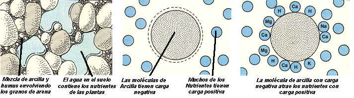

A la capacidad de retener los iones en el suelo esta se le llama **poder adsorbente. **Si estos nutrientes no se quedaran fijadas en el complejo arcillo-húmico se perderían por el arrastre que origina la lluvia o el riego.

Los suelos arcillosos y los francos son los que tiene una mejor capacidad de almacenaje de nutrientes; los suelos arenosos apenas retienen nutrientes. Un buen plan de abonados tiene que conocer el tipo de suelo en el que se va a implantar. En suelos arcillosos se pueden aportan más cantidades de fertilizante en cada aplicación, espaciándolos en el tiempo, y en los suelos arenosos debido a su poca capacidad de retención para la misma cantidad de abono total hay que aplicarla en pequeñas dosis a intervalos de tiempo más frecuentes.

Los cationes retenidos por el complejo arcillo-húmico, están en equilibrio con los de la solución, dando lugar a un intercambio catiónico. La planta absorbe los elementos nutritivos de la solución del suelo y, cuando los absorbe, el complejo arcillo-húmico repone el elemento absorbido a la solución del suelo. Se conoce por la **capacidad de intercambio catiónico** a la cantidad total de cationes que pueden ser retenidos por unidad de masa del suelo y que pueden ser intercambiados. Se expresa en miliequivalentes/100 gr. de suelo seco (meq/100g). Según la textura la CIC es distinta:

Valores por debajo de 5 meq./100g., son muy bajos, indicando que se trata de un suelo poco fértil. Por el contrario, valores cercanos a 30 meq./100 g., indican que nos encontramos ante un suelo excesivamente arcilloso o con un elevado contenido en materia orgánica, en el que existiría grave riesgo de asfixia radicular.

| ***TEXTURA*** | ***CIC (meq/100g)*** |
| --- | --- |
| *Arenoso* | *1-5* |
| *Francoarenoso* | *5-10* |
| *Franco* | *5-15* |
| *Francoarcilloso* | *15-30* |
| *Arcilloso* | *50* |
| *Humus* | *100-400* |

### pH

Como ya hemos visto los iones se encuentras disueltos en el agua del suelo. Algunos suelos poseen **mayor cantidad de iones hidrógeno (H+)** que iones hidroxilo (OH-), este hecho les confiere un **carácter más ácido**, si tienen **más grupos hidroxilos ****(OH-)** que iones hidrogeno (H+) sería un **suelo básico**. Cuando un suelo posee el mismo número de iones hidroxilo (OH-) que concentración de iones hidrogeno (H+) se llama suelo neutro. La relación que existe entre estos iones se expresa en forma de pH.

Por tanto el pH del suelo es la medida de la acidez o alcalinidad de un suelo, y afecta a la disponibilidad de los nutrientes, la actividad de los microorganismos del suelo (formación del humus) y la solubilidad de los nutrientes del suelo. El hecho de que un terreno sea ácido o básico puede comportar la falta (carencia) o la toxicidad de uno o varios elementos, ya que cada uno tiene su banda óptima de pH para ser absorbido (grado de disponibilidad para la planta).

El pH del suelo también afecta a la actividad de los microorganismos beneficiosos. Por regla general, la mayoría de hongos funcionan bien en un rango amplio de pH, pero las bacterias trabajan mejor a pH intermedios o algo elevados.

El pH del suelo viene definido por la concentración de iones hidrógeno H+ presentes en la solución del suelo. El pH del suelo se puede medir con un peachímetro disolviendo muestras de suelo en un vaso con agua destilada.

El valor de pH varía entre 0 y 14.

El intervalo de pH comprendido entre 6-7 es el más adecuado para la asimilación de nutrientes por parte de las plantas.

La mayoría de los suelos se encuentran entre los rangos de 5–8,5. Los valores de pH medio y alto favorecen la actividad de los microorganismos del suelo.

***               ******R******ango de pH de disponibilidad de nutrientes******                                             ******R******ango de pH  para ******suelos***

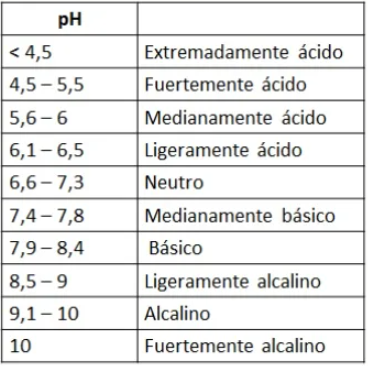

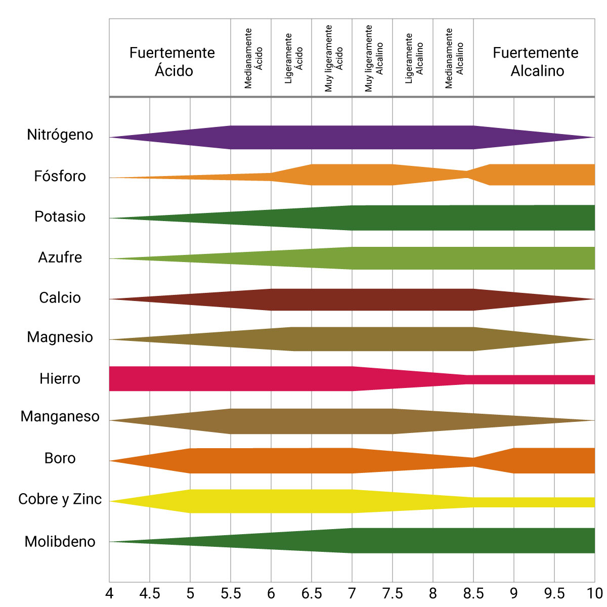

*** 	******Ra******ngo de pH óptimo de cultiv******o******                ***

*	Pepino: 5,7-7,2*

*	**T**omate: 5,8-7,2*

*	Patata: 5,0-5,8 *

*	Pimiento: 6,3-7,8*

*	Naranjo: 6,0-7,5*

*	Almendro: 6,0-6,*8

### Conductividad eléctrica

La conductividad eléctrica es la medida de la cantidad de sales disueltas que hay en una solución. En nuestro caso la solución puede ser el agua de riego, la solución del suelo o la solución nutritiva. Se puede expresar en g/l.

Este sistema se basa en la facilidad con que pasa la corriente eléctrica a través de un líquido: a mayor cantidad e sales disueltas, mayor facilidad de paso y, por tanto, mayor conductividad eléctrica.

La conductividad eléctrica del suelo no se mide directamente en el suelo. Se prepara un extracto saturado que se asemeja a la solución del suelo. Para su medida empleamos el Conductivímetro.

Las unidades de medida más utilizadas son Milimho por centímetro (mmho/cm) y MiliSiemens por centímetro (mS/cm).

**Saber la conductividad eléctrica del suelo agrícola es fundamental por varias razones**:

- ******Calidad del suelo****: La conductividad eléctrica puede indicar la salinidad del suelo. Niveles altos de conductividad pueden señalar la presencia de sales disueltas en el suelo, lo cual puede afectar negativamente el crecimiento de las plantas.**

- ******Gestión del riego****: Conocer la conductividad eléctrica ayuda a gestionar de manera eficiente el riego. Suelos con alta conductividad pueden requerir ajustes en la cantidad y frecuencia de riego para evitar acumulaciones de sales que afecten la absorción de nutrientes por las plantas.**

- ******Diagnóstico de problemas****: Puede utilizarse como indicador de problemas de drenaje. Suelos con alta conductividad pueden estar mal drenados, lo que afecta la disponibilidad de oxígeno para las raíces y el crecimiento de las plantas.**

- ******Monitoreo de la fertilidad****: La conductividad eléctrica puede estar relacionada con la disponibilidad de nutrientes en el suelo. Un monitoreo regular puede ayudar a ajustar los programas de fertilización para mantener niveles óptimos para el crecimiento de los cultivos.**

En resumen, medir la conductividad eléctrica del suelo es una herramienta clave para entender su calidad, gestionar el riego de manera efectiva y asegurar condiciones óptimas para el crecimiento de los cultivos.

#### Beneficios de las sales disueltas en el suelo:

- ******Fuente de nutrientes esenciales****: Algunas sales contienen nutrientes esenciales para las plantas, como nitratos, fosfatos, sulfatos, calcio, magnesio y potasio. Estas sales en concentraciones adecuadas favorecen el crecimiento y desarrollo de los cultivos.**

- ******Regulación del equilibrio osmótico****: Una concentración adecuada de sales en el suelo ayuda a que las plantas absorban agua y nutrientes de manera eficiente.**

- ******Mejora de la estructura del suelo****: Ciertas sales, como el calcio en forma de yeso (sulfato de calcio), pueden mejorar la estructura del suelo, evitando su compactación y facilitando el desarrollo radicular.**

### Perjuicios del exceso de sales en el suelo

- ******Problemas de salinidad****: Si la cantidad de sales es demasiado alta, las plantas tienen dificultades para absorber agua, lo que puede provocar ********estrés hídrico y deshidratación**** (aunque el suelo esté húmedo).**

- ******Toxicidad para las plantas****: Algunas sales, como los cloruros y sodios en exceso, pueden ser tóxicas y afectar el crecimiento, reduciendo la producción y calidad del cultivo.**

- ******Compactación y deterioro del suelo****: Exceso de sodio en el suelo puede provocar ********dispersión de partículas****, reduciendo la infiltración del agua y aumentando la compactación.**

- ******Dificultad para la germinación****: Semillas y plántulas jóvenes pueden verse afectadas por la salinidad, impidiendo su correcta germinación y establecimiento.**

#### Conclusión

Las sales en el suelo son beneficiosas en concentraciones adecuadas, ya que aportan nutrientes esenciales.

El exceso de sales es perjudicial, ya que genera problemas de salinidad y toxicidad para las plantas.

¿Cómo evitar problemas de salinidad?

- Monitorear la conductividad eléctrica del suelo regularmente.

- Implementar buenas prácticas de riego para evitar acumulación de sales.

- Aplicar materia orgánica para mejorar la estructura del suelo y su capacidad de retención de agua.

- Usar drenaje adecuado en zonas con riesgo de salinización.

#### Tabla de Conductividad Eléctrica en Suelos Agrícolas

| Conductividad Eléctrica (dS/m o mS/cm) | Nivel de salinidad | Impacto en las plantas |
| --- | --- | --- |
| < 0.2 | Muy baja | Puede indicar falta de nutrientes esenciales. |
| 0.2 - 0.8 | Óptima para la mayoría de los cultivos | Suelo adecuado para el crecimiento sin problemas de salinidad. |
| 0.8 - 2 | Ligeramente salino | Algunas plantas sensibles pueden verse afectadas. Se recomienda monitoreo. |
| 2 - 4 | Moderadamente salino | Pérdida de rendimiento en cultivos sensibles. Se requieren estrategias de manejo. |
| 4 - 8 | Altamente salino | Solo cultivos tolerantes pueden crecer bien. Es necesario lavado con riego abundante. |
| > 8 | Fuertemente salino | La mayoría de los cultivos no pueden crecer. Se necesita una corrección urgente del suelo. |

### Salinidad.

Un suelo es salino cuando tiene un exceso de sales solubles que impiden o dificultan el normal desarrollo de las plantas al impedir la correcta absorción del agua por las raíces y la dispersión de las partículas del suelo. Las sales pueden encontrarse en el suelo de varias formas: precipitadas baja forma de cristales, disueltas en la solución del suelo o adsorbidas en el complejo arcillo-húmico.

La meteorización de la roca madre es el origen primario de las sales solubles, aunque los problemas que tenemos en la actualidad en las producciones agropecuarias no derivan de aquí, sino de la aportación de sales que se han sido incorporando con el agua de riego o fertirrigación.

Los suelos salinos se caracterizan por encontrarse en zonas de baja pluviometría y alta evapotranspiración. En periodos cálidos las sales se condensan en la capa superficial del suelo, donde están las raíces, dando problemas de toxicidad. Cuanto más soluble sea una sal, mayor concentración podrá tener en la solución del suelo. Las sales más tóxicas por tanto son las que presenta mayores solubilidades. La salinidad del suelo la podemos medir a través de su conductividad eléctrica.

Los dos grandes problemas que producen la concentración de sales en el suelo son: la dificultad de absorción de agua por las raíces, al ser atraída el agua por los iones de la solución y la dispersión de las partículas del suelo, lo que impide desarrollar una estructura estable.

Las sales más solubles en el suelo son aquellas que se disuelven fácilmente en agua y pueden afectar la conductividad eléctrica y la salinidad. A continuación, mencionamos las principales:

- Cloruro de sodio (NaCl) - Sal común: Muy soluble en agua. Es una de las sales más problemáticas en suelos salinos y afecta la absorción de agua por las plantas (estrés osmótico).

- Sulfato de sodio (Na₂SO₄): Alta solubilidad. Puede aumentar la salinidad del suelo sin formar costras superficiales.

- Cloruro de calcio (CaCl₂): Extremadamente soluble. Se usa en algunos suelos para mejorar la estructura y desplazar sodio perjudicial.

- Nitrato de sodio (NaNO₃) y nitrato de calcio (Ca(NO₃)₂): Altamente solubles. Fuentes de nitrógeno para fertilización, pero pueden lixiviarse fácilmente con el riego.

- Sulfato de magnesio (MgSO₄) - Sal de Epsom: Alta solubilidad. Se usa como fertilizante de magnesio en suelos deficientes.

- Bicarbonato de sodio (NaHCO₃): Moderada solubilidad. Puede aumentar el pH del suelo y afectar la disponibilidad de nutrientes

- Sulfato de potasio (K₂SO₄) y cloruro de potasio (Kcl): Altamente solubles. Usados como fertilizantes de potasio, pero en exceso pueden aumentar la salinidad.

#### Impacto en los cultivos

- Las sales de sodio (NaCl, Na₂SO₄, NaHCO₃) son las más dañinas porque afectan la absorción de agua y deterioran la estructura del suelo.

- Las sales de calcio y magnesio pueden ser beneficiosas en suelos con problemas de sodio, ayudando a mejorar la estructura del suelo.

- Las sales de nitratos y sulfatos suelen ser nutrientes esenciales, pero su exceso puede causar contaminación y lixiviación.

Si un suelo tiene una alta acumulación de sales solubles, es recomendable realizar lavados con agua de buena calidad, mejorar el drenaje y evitar el riego con aguas salinas.

### El Calcio y el Sodio en el suelo

Otro elemento que tiene un papel fundamental en la estructura del suelo es el ión** calcio (Ca2+).** El calcio colabora junto con el humus a la unión de las partículas del suelo.

El **sodio ****(Na+)** es un elemento dispersante en el suelo, rompe la estructura del suelo, los agregados, de tal forma que puede llegar a formarse una capa impermeable ya que los poros del suelo van taponándose.

**Se dice que el calcio agrega mientras que el sodio dispersa el suelo.**

Los suelos sódicos son suelos asfixiantes, y generalmente tienen un pH superior a 8.5, suelen tener colores oscuros dada la dispersión de las arcillas y la materia orgánica.

La cantidad de sodio que tiene un suelo se mide por el Porcentaje de Sodio Intercambiable (P.S.I.):

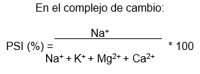

El valor de PSI debe ser lo más bajo posible, aunque se consideran aceptables valores por debajo del 10%. Hay que evitar que el PSI sea superior al 15% ya que a partir de este valor el suelo se considera suelo sódico o salino-sódico y presenta grandes problemas de permeabilidad, asfixiante y muy difícil de recuperar.

Para poder recuperar los suelos sódicos, lo primero que hay que hacer es desplazar al sodio del complejo de cambio y después, lavarlo.

El calcio es el ión mejor para desplazar al sodio, de forma que en suelos con poco calcio se aplica yeso (sulfato de calcio) y el calcio desplaza al sodio, y éste se lava.

## PROPIEDADES BIOLÓGICAS DEL SUELO.

El suelo, además de ser el soporte para el crecimiento de los cultivos, es un ecosistema dinámico y lleno de vida. En él habitan millones de organismos que, a través de su actividad biológica, contribuyen a su fertilidad y estructura. Cuando pensamos en los seres vivos del suelo, es común imaginar lombrices, hormigas, escarabajos, topos o incluso pequeños roedores y aves que anidan en él. Sin embargo, a menudo se pasa por alto la presencia de los microorganismos, que, aunque invisibles a simple vista, desempeñan un papel esencial en los procesos biogeoquímicos del suelo.

Las propiedades biológicas del suelo están determinadas principalmente por la cantidad y diversidad de organismos vivos que alberga, tanto macroorganismos como microorganismos, así como por el contenido de materia orgánica. Estos organismos cumplen funciones clave como la descomposición de la materia orgánica, el reciclaje de nutrientes, la formación de agregados del suelo y la regulación de su estructura y fertilidad.

### Microorganismos.

Los microorganismos son organismos microscópicos que no pueden observarse a simple vista y requieren el uso de un microscopio para su estudio. Su diversidad y actividad son fundamentales para la fertilidad del suelo, el equilibrio ecológico y la estabilidad de los ecosistemas, tanto naturales como agrícolas.

Existen diversas categorías de microorganismos en el suelo, pero los más relevantes en los sistemas agrícolas son:

- ******Bacterias****: Intervienen en la descomposición de la materia orgánica, la fijación del nitrógeno atmosférico y en procesos como la nitrificación y desnitrificación. ****Ej:**

- Las bacterias del género Rhizobium establecen una simbiosis con las raíces de las leguminosas (como la alfalfa o los guisantes), formando nódulos radiculares donde fijan nitrógeno, transformándolo en formas asimilables por las plantas.

- ***Nitrosomonas** y ****Nitrobacter** participan en la conversión del amonio en nitratos, proceso fundamental para la fertilización del suelo. *

- ******Hongos****: Contribuyen a la degradación de compuestos más complejos, como la celulosa y la lignina. Algunos forman relaciones simbióticas con las raíces de las plantas (micorrizas), mejorando la absorción de agua y nutrientes. ****Ej:**

- **Los hongos micorrícicos, como ********Glomus intraradices****, establecen simbiosis con muchas especies agrícolas (trigo, maíz, árboles frutales), aumentando la absorción de fósforo y protegiendo contra patógenos del suelo. **

- ******Algas****: Aunque menos conocidas, las algas del suelo participan en la producción de materia orgánica y en la estabilización de la estructura del suelo. ****Ej:**

- **Las cianobacterias del género ********Nostoc**** pueden fijar nitrógeno en suelos húmedos, mejorando su fertilidad, especialmente en cultivos de arroz en zonas encharcadas. **

- ******Actinomicetos****: Son microorganismos intermedios entre bacterias y hongos que contribuyen a la descomposición de materia orgánica y a la producción de antibióticos naturales. **

- *********Streptomyces****** es un género de actinomicetos que degrada compuestos complejos y produce antibióticos naturales que ayudan a controlar patógenos del suelo. ***

La mayor parte de los microorganismos del suelo se concentran en los primeros 60 cm, especialmente en el Horizonte A, donde la materia orgánica es más abundante y las condiciones de humedad y oxígeno favorecen su desarrollo.

Las principales funciones de los microorganismos en el suelo incluyen:

- ******Descomposición de la materia orgánica****, transformando residuos vegetales y animales en nutrientes disponibles para las plantas. ****Ej: **

- *********Bacillus subtilis****** es una bacteria que descompone restos de cultivos en compost, liberando nutrientes esenciales. ***

- *********Participación en el ciclo de nutrientes******, facilitando procesos clave como la fijación de nitrógeno, la mineralización del fósforo y la formación de humus. ******Ej:***

- *********Azotobacter****** es una bacteria de vida libre que fija nitrógeno en suelos bien aireados, sin necesidad de asociarse con raíces. ***

- ******Contribución a la formación de la estructura del suelo****, favoreciendo la agregación de partículas y la estabilidad de los poros, lo que mejora la aireación y la retención de agua. ****Ej:**

- **Los exudados de bacterias y hongos actúan como "pegamento biológico", formando agregados estables que mejoran la estructura del suelo. **

### Animales del suelo.

El suelo alberga una gran diversidad de animales que, aunque menos numerosos que los microorganismos, cumplen funciones esenciales en la dinámica del ecosistema edáfico. Estos organismos se pueden clasificar en diferentes grupos según su tamaño y función:

- ******Nematodos****: Gusanos microscópicos que participan en la descomposición de materia orgánica y pueden tener funciones beneficiosas o perjudiciales, dependiendo de su tipo (algunos son parásitos de plantas). ****Ej:**

- *********Steinernema carpocapsae****** es un nematodo utilizado en control biológico porque parasita insectos plaga en cultivos hortícolas. ***

- *********Artrópodos******: Insectos, ácaros y ciempiés que fragmentan los restos orgánicos y regulan las poblaciones microbianas mediante la depredación. ******Ej:***

- Los colémbolos (como Folsomia candida) descomponen restos vegetales y estimulan la actividad microbiana.

- Los escarabajos estercoleros (Scarabaeus) entierran estiércol, facilitando su incorporación al suelo y mejorando su fertilidad.

- *********Lombrices de tierra******: Organismos clave en la formación del suelo fértil, ya que favorecen la aireación, la mezcla de partículas y la mineralización de nutrientes a través de su actividad digestiva. ******Ej:***

- *********Eisenia fetida****** es una lombriz utilizada en vermicompostaje, produciendo humus rico en nutrientes a partir de materia orgánica. ***

- ******Mamíferos del suelo****: Animales como topos y ratones que excavan galerías, mejorando la porosidad del suelo y facilitando la infiltración de agua y oxígeno. ****Ej:**

- **Los topos (********Talpa europaea****) ayudan a controlar poblaciones de insectos dañinos al alimentarse de ellos. **

Las funciones más importantes que los animales del suelo desempeñan incluyen:

- ******Incorporación de materia orgánica****, contribuyendo a su descomposición y transformación en humus.**** ****Ej: **

- **Las lombrices digieren restos orgánicos y los convierten en humus, mejorando la fertilidad del suelo. **

- ******Aireación y mejora de la estructura del suelo****, mediante la excavación de túneles y madrigueras, lo que facilita el movimiento del agua y los gases. ****Ej: **

- **Los topos crean galerías que favorecen la infiltración del agua, evitando encharcamientos. **

- ******Control de poblaciones microbianas y de otros organismos****, a través de interacciones tróficas que regulan el equilibrio del ecosistema.**

- **Los escarabajos depredadores (********Carabidae****) ayudan a controlar plagas al alimentarse de larvas de insectos perjudiciales. **

## ANÁLISIS DE SUELOS.

Los análisis de suelos proporcionan información sobre las propiedades físicas, químicas y biológicas (en su caso) de los suelos, constituyendo una herramienta necesaria para el manejo de los cultivos.

Podemos considerar que la utilidad de los análisis de suelos se basa en cuatro razones fundamentales:

- **Aportar la dosis adecuada de fertilizantes****: no hacer aportes en exceso sino en la dosis justa con lo que conseguiremos un ahorro económico y, una reducción del impacto ambiental, evitando al acumulación y contaminación innecesaria que provoca el exceso de abonos.**

- **Evitar deficiencias**** por falta de un nutrientes en concreto o por desequilibrios.**

- **Aumentar la productividad y la calidad de las cosechas****, como consecuencia de una fertilización ajustada y equilibrada.**

- **Aumentar la rentabilidad****, derivada del ahorro de fertilizantes y de la mayor productividad.   **

Como mínimo se debería realizar un análisis de suelos en los siguientes casos:

- Antes de la implantación de un nuevo cultivo, para conocer el estado de nutrientes del suelo y poder realizar una fertilización que ajuste las necesidades de nutrición que se van a producir.

- Para cultivos extensivos cada 3-4 años, para cultivos intensivos cada año, para cultivo frutales cada 1-3 años.

### TOMA DE MUESTRAS EN CAMPO

Es la parte más importante y más difícil del análisis de suelos. El análisis de una muestra mal tomada no tiene ningún valor, sino el de inducir una fertilización equivocada con consecuencias de gravedad variable.

Para que una muestra sea útil debe ser representativa de la parcela a analizar. Para ello se deben seguir las siguientes normas:

- La parcela a estudiar debe dividirse en zonas de igual color, textura, topografía, con el mismo tipo de cultivo y plan de abonados. Un ejemplo: si en una misma parcela hemos sembrado dos cultivos diferentes, habrá que establecer dos zonas de muestreo.

- Evitar las zonas colindantes a caminos, acequias, zonas de paso y alimentación de ganado.

- Por lo general, aunque la parcela fuera muy homogénea, cada muestra de suelo no debería representar una superficie mayor de 2 Ha. (incluso menos, en producciones muy intensivas).

- Las submuestras se toman al azar se recorre toda la finca en zigzag y se marcan los puntos de muestreo, evitando siempre las zonas que no son representativas.

- El número de muestras va a depender de la heterogeneidad de la parcela. Cada muestra de suelo está formada por varias submuestras, se aconseja un mínimo 10-20 submuestras para parcelas homogéneas de 1 Ha.

Una vez realizadas todas las submuestras se mezclan bien y se recoge aproximadamente un kilogramo de tierra total. Lo que sobra se tira. El Kg. de muestra será el que enviaremos al laboratorio para su análisis, previamente lo habremos identificado indicando que zona representa.

Dependiendo del lugar donde llevemos la muestra a analizar nos mandarán un sencillo cuestionario al que adjuntaremos a la muestra, y donde nos piden datos sobre el cultivo que queremos implantar, historial del cultivo, etc.

### TIPOS DE ANÁLISIS DE SUELOS

El análisis de suelos es una herramienta esencial para conocer las características físicas, químicas y biológicas del suelo, permitiendo tomar decisiones informadas sobre su manejo. Existen distintos tipos de análisis según los parámetros que se deseen evaluar.

#### ANÁLISIS FÍSICO

El análisis físico del suelo se centra en la evaluación de su estructura y textura, parámetros fundamentales que influyen en su capacidad de retención de agua, aireación y facilidad para el desarrollo de las raíces.

##### ******Determinación de la textura**

La textura del suelo se refiere a la proporción de partículas minerales de diferente tamaño:

- ******Arena**** (granos gruesos, entre 0.05 y 2 mm de diámetro).**

- ******Limo**** (partículas intermedias, entre 0.002 y 0.05 mm).**

- ******Arcilla**** (las partículas más finas, menores a 0.002 mm).**

Esta información puede expresarse en el análisis de dos formas:

- ******Porcentajes de arena, limo y arcilla****.**

- Ejemplo: Un suelo puede clasificarse como 50% arena, 30% limo y 20% arcilla.

- ******Denominación según el triángulo textural del USDA****.**

- Ejemplo: Un suelo con 30% arcilla, 40% limo y 30% arena se clasifica como franco-arcilloso.

La textura del suelo influye directamente en la elección del sistema de riego, la fertilización y el manejo del cultivo. Por ejemplo, los suelos arenosos requieren riegos más frecuentes, mientras que los arcillosos retienen más agua, pero pueden presentar problemas de drenaje.

#### ANÁLISIS QUÍMICO

El análisis químico del suelo evalúa la disponibilidad de nutrientes, la presencia de sales solubles y el pH, factores clave para la nutrición vegetal. Dependiendo de los objetivos, se pueden realizar dos tipos principales de análisis:

- ******Análisis de fertilidad**

- ******Análisis de extracto saturado**

La interpretación de los análisis debe realizarse con el apoyo de asesoramiento técnico. Los resultados se comparan con tablas de referencia para determinar la disponibilidad de nutrientes y tomar decisiones sobre fertilización y manejo del suelo.

##### Análisis de fertilidad

Este análisis permite conocer la capacidad del suelo para suministrar los nutrientes esenciales para el crecimiento de las plantas. Sus principales objetivos son:

- ******Detectar desequilibrios nutricionales**** que puedan limitar el desarrollo del cultivo.**

- ******Conocer la fertilidad del suelo**** cuando no existen datos previos (por ejemplo, al adquirir una nueva finca o en suelos recientemente preparados para cultivo).**

- ******Calcular el abonado**** necesario para optimizar la producción y evitar excesos de fertilización.**

El análisis de fertilidad mide macronutrientes como nitrógeno (N), fósforo (P) y potasio (K), así como micronutrientes esenciales como hierro (Fe), zinc (Zn) y manganeso (Mn).

###### Ejemplo: Si un análisis indica niveles bajos de fósforo, puede recomendarse la aplicación de fosfato diamónico (DAP) o superfosfato triple, dependiendo del tipo de suelo y cultivo.

##### Análisis de extracto saturado

Este análisis evalúa los elementos disueltos en la solución del suelo, que están directamente disponibles para la planta. Se utilizan principalmente en suelos con problemas de salinidad o en cultivos de alto valor donde se requiere un control preciso de la fertilización.

###### Objetivos del análisis de extracto saturado:

- ******Control de la salinidad****, evitando daños por acumulación de sales en suelos o por riego con aguas salinas.**

- ******Manejo adecuado de la fertilización****, ajustando la disponibilidad de nutrientes según el crecimiento del cultivo.**

- ******Identificación de desequilibrios nutricionales****, asegurando un desarrollo óptimo de la planta.**

En este análisis se determinan pH y conductividad eléctrica (CE), parámetros clave para evaluar la calidad del suelo:

#### Clasificación de los suelos según el pH:

| **tipo de suelo** | **valor de ph** |
| --- | --- |
| Muy ácido | < 5.5 |
| Ácido | 5.6-6.5 |
| Neutro | 6.6-7.5 |
| Alcalino | 7.6-8.5 |
| Muy alcalino | > 8.6 |

###### Ejemplo: Si un suelo presenta un pH de 5.2 (muy ácido), es recomendable la aplicación de cal agrícola (carbonato de calcio) para elevar el pH y mejorar la disponibilidad de nutrientes como fósforo y calcio.

#### Clasificación de los suelos según la conductividad eléctrica (CE) en el extracto saturado:

| **tipo de suelo** | **CE en ms/cm** |
| --- | --- |
| No salino | 0-2 |
| Ligeramente salino | 2-4 |
| Moderadamente salino | 4-8 |
| Fuertemente salino | 8-16 |
| Muy fuertemente salino |  16 |

###### Ejemplo: Si un suelo tiene una CE de 9 mS/cm (fuertemente salino), es recomendable aplicar un riego de lixiviación para arrastrar las sales fuera de la zona radicular y evitar problemas de toxicidad en las plantas.

#### Determinación de elementos en el extracto saturado y valores de referencia: Los valores de referencia para los principales elementos en solución se expresan en meq/L o ppm y ayudan a interpretar la disponibilidad de nutrientes.

Las determinaciones de los elementos que se realizan y los valores de referencia son los siguientes, expresados en meq/l:

|  | **Bajo** | **Medio** | **Alto** |
| --- | --- | --- | --- |
| **Calcio** | 1-10 | 10-60 | >60 |
| **Magnesio** | 0,2-5 | 5-30 | >30 |
| **Sodio** | 0,1-3,5 | 3,5-15 | >15 |
| **Potasio** | 0-0,9 | 0,9-5 | >5 |
| **Boro (ppm)** | 0,1-0,5 | 0,5-1 | >1 |
| **Nitratos** | 0-2 | 2-6 | >6 |
| **Cloruros** | 0,2-5 | 5-15 | 15-25 |
| **Sulfatos** | 10-20 | 20-30 | >30 |
| **Bicarbonatos** | 0,1-2,5 | 2,5-5 | >5 |

Tal y como acabamos de ver el análisis de suelos es una herramienta clave para la toma de decisiones en la gestión agrícola. Conocer las propiedades físicas y químicas del suelo permite mejorar la fertilización, prevenir problemas de salinidad y optimizar el crecimiento de los cultivos. La correcta interpretación de los resultados, junto con el asesoramiento técnico, garantiza un manejo sostenible del suelo y una producción eficiente.
